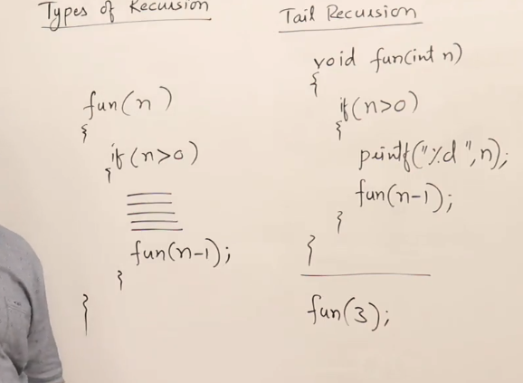

---
aliases:
  - tail-recursion
  - types-of-recursions
---
# 4. Recursion with Arrays
Created Saturday 28 December 2019


* Some problems are very tedious to solve using iterative methods, they may ultimately require a programmers stack. 
* Difference between head recursion and tail recursion.

```cpp
// e.g check if given array is sorted or not
 // Method 1: if(n<=1) return true.
if arr[0]<=arr[1] check further in f(arr+1, n-1)
else return false;
// it will ultimately reach n-1.
**Tail recursion. Easier to convert to an iteration.**
Method 2: if(n<=1) it is sorted by default.
if(f(arr+1, n-1)==true)
{
if(arr[0] <=arr[1]
return true;
}
return false;
**Head recursion.** **Difficult to convert to an iteration.**
```

## Types of recursions
1. Tail - the recursive function is the last thing, i.e. no work is done in the backward phase.
2. Head - the recursive function is the last thing, i.e. no work is done in the forward phase.
3. Tree - multiple recursive calls happen at each level, possibly redundant. There are many children from one node, in the stack diagram. No cycles though.
4. Indirect - there are multiple recursive functions that call each other.
5. Nested - parameters of recursive calls are result of already computed recursions. `f(f(n-1))`

## Tail recursion
Tail recursion is special. Although every recursion can be converted into a loop, and vice-versa, a stack may be needed in many cases.

But tail recursion is special in that it can easily be converted into a loop without a stack.

This is significant because it:
1. Helps us simplify (tail) recursions into loops.
2. Reduced memory usage. We go from needing O(n) space to O(1) space.

Time complexity remains the same, however, since computation (code above the call) still runs as is.
