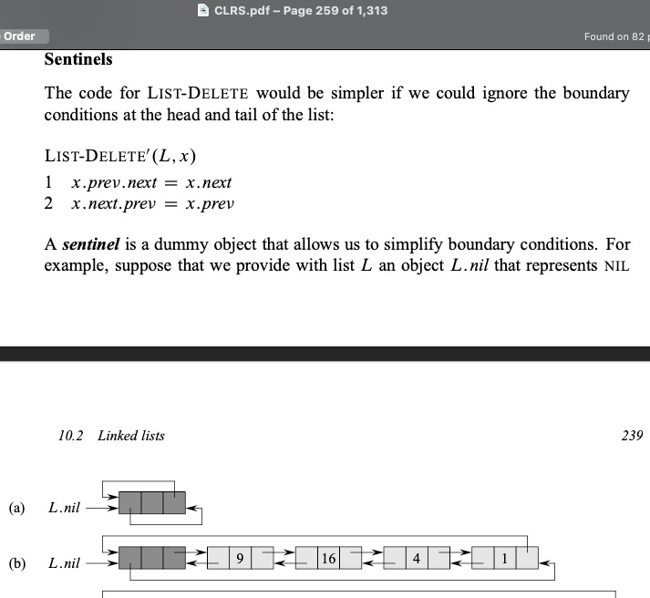

---
tags:
  - sentinels
---
# 2. Popular LL problems
Created Saturday 18 January 2020#

Remember while making an LL recursively, it's better to add nodes at the beginning as you have to return the node anyways.

[Codes](./2._Popular_LL_problems/Codes)
[Exercises.md](./2._Popular_LL_problems/Quizzes&Exercises/Exercises.md)
[CodingExercises.md](./2._Popular_LL_problems/Quizzes&Exercises/CodingExercises.md)
[Assignments.md](2._Popular_LL_problems/zAssignments/Assignments.md)

## Sentinels


Without the dummy this would be laborious and hard.

More tricks like this, like negative mass in gravity problems, help a lot. Small proof then you're good to go. Like here asymptomatically the dummy is insignificant.

Example - https://leetcode.com/problems/remove-linked-list-elements/
```cpp
/**
 * Definition for singly-linked list.
 * struct ListNode {
 *     int val;
 *     ListNode *next;
 *     ListNode() : val(0), next(nullptr) {}
 *     ListNode(int x) : val(x), next(nullptr) {}
 *     ListNode(int x, ListNode *next) : val(x), next(next) {}
 * };
 */
class Solution {
public:
    ListNode* removeElements(ListNode* head, int val) {
        if(!head) return head;

        // to avoid boundary conditions, add a dummy at the beginning
        ListNode* dummy = new ListNode;
        dummy -> val = val + 1; // doesn't matter
        dummy -> next = head;

        ListNode* t = dummy;

        while (t -> next) {
            if(t -> next -> val == val)
                t -> next = t -> next -> next; // removed
            else
               t = t -> next;
        }

        return dummy -> next;
    }
};
```