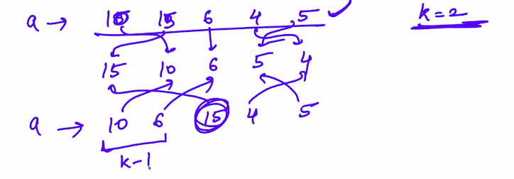

# 1. K sorted array
Created Sunday 16 February 2020

What does k sorted array mean?
Ans: An array in which after being sort, all the elements are at most k-1 positions away from the original position.

- Remember an element is 0 away from itself.
- Talking of index, for given i, we can go, i-k+1 or k-1+i.

e.g This is not a k=2 sorted array, because 15 moves by two places, whereas maximum moves allowed are k-1.

Q) Sort a k sorted array:
A) To do this, we can do the following.For every index i, we can give a range. e.g for the zerowth index, we have possibilties from index 0 to k-1. So we seek the minimum of them and put it at its place. We keep on doing this.

- The left part is always being sorted.
- We can swap elements to ensure in-place sort.

Suppose we have size = multiple of k

1. For one pass, we have T.C = k + k-1 + k-2 + ... +1 = k(k+1)/2
2. We need to make n/k passed.
3. Total time = n/k \* k(k+1)/2 = n(k+1)/2

How is this related to priority queue?
We need **maximum** elements at each instance.
So we do heapify for the k stack. Then we say getMax(or pop).
T.C for 1 pass: k.logk + logk.k = klogk.
Total passes: n/k.
T.C = 2*klogk*n/k = 2\*k log(n) = O(nlog(k)) ~ O(n)

Note: When you here maximum or minimum, flash heap.
