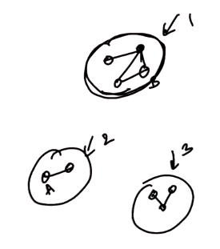

# 2. Graph Terminology
Created Monday 30 March 2020

## Jargon
1. Graph - a set of nodes, and a set of edges that connect nodes with each other (including self connection).
2. Vertices - nodes are called vertices.
3. Edges - a line that connects two vertices.
4. Adjacent vertices - two vertices connected by a edge.
5. Degree - this (defined for a vertex) is the number of edges connected to a vertex(incoming is taken as +ve degree for outgoing, if graph is directed)
6. Path - An ordered set of edges from a vertex A to B.
7. Connected graph - If every vertex is reachable from every other vertex, then this graph is called a connected graph. Simply said, there are no disjoint groups.
8. Connected components - The groups of connected graphs in a given graph. For a connected graph, number of connected components is 1. For a non connected graph it is greater than one.
	
8. Cycle - A path which starts from a vertex and comes back to the same vertex. A cycles must have at least 2 distinct edges in its path (i.e. self directed edges are not counted as cycles).
9. Tree - a connected graph with no cycles.
10. Uni-graph (or just graph) - multiple edges between (between any two nodes) is not allowed.
11. Multigraph - a pair of nodes may have multiple edges between them.
12. Directed graphs - edges have a direction. Undirected: edges don't have a direction
13. Weighted: edges have a weight. Unweighted: edges have no weight (or assume they have the same weight).

---
## Range of edges, vertices and degree
Given a graph V, E.

- minimum number of edges = 0. All vertices are separate. A fully disconnected graph.
- minimum number of edges in a connected graph = all are connected but uses the least edges to connect = no cycles at all = A **tree** or a circle graph (except the root, number of edge vertex pairs are n-1) = n-1
- maximum edges = **complete graph** = each edge is connected to every other edge = all posssible connections among all vertices = nC2 = n(n-1)/2
