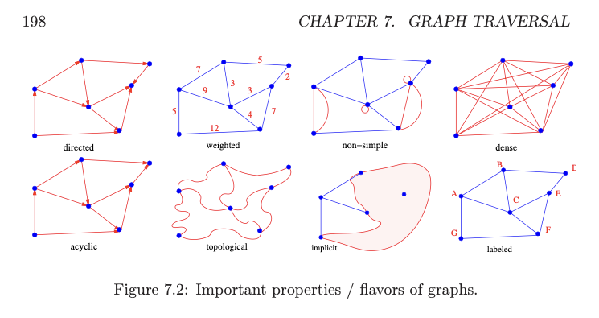

# 3. Graph varieties
Created Wednesday 01 April 2020

## How to create unified graph structure
Suppose we have a graph E and V, and pairs are denoted by i and j.
And we're trying to create G (adjacency list/matrix/hashmap).

1. For undirected graphs. Given i and j are connected. We make both G\[i]\[j] = true and G\[j]\[i] = true.
2. For directed graphs - We make G\[i]\[j] = true (read i to j) if i and j are neighbours (not on G\[j]\[i]).
3. For weighted graphs - Store the weight from a to b in E\[i]\[j] = 2 (or whatever weight) and E\[j]\[i] = 2.
4. For directed weighted - store weight in one direction. (i, j) only and not (j, i).
5. For self loop directed. Store the loops with edges\[i]\[i] as an integer.
6. For weighted multigraph, store the edge as a `vector<int>` of weights. Simple.
7. Cyclic vs non cyclic. Trees and DAGs are two types of graphs without cycles. DAGs arise naturally to model dependencies and planning.
8. Implicit or explicit - we have E, V before hand, or are we discovering it during traversal.
9. Labeled vs unlabeled - does each node have a unique identifier, or not.

More flavors of graphs mentioned in Skiena page 198
