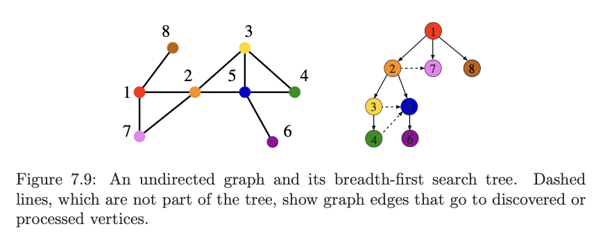

# 2. BFS
Created Tuesday 31 March 2020

This is also a traversal/search technique.

## Algorithm
In constrast with DFS, here we first print all the neighbours of the current node. Then we explore each one of them.

- Its iterative and we need a queue here. mAid.

1. We'll use a queue for this. We'll put the neighbours inside. When done, we'll pop the current node.
2. But when we see all neigbours  after coming from the predecessor, we can again put(erroneously) it in the queue. To avoid this, we use a visited array.
3. We go through all vertices, calling BFS from it if they are absent from visited, at the same time checking if visited.size()<V. This ensures that **disconnected components are also taken into account.**

## Pseudocode
```js
function bfs() {
	q = [root];
	vis = { root: true }; // dont enqueue again notepad
	
	while(q.empty()) {
		node = q.pop();
		if (node.value = key) return true;
		
		for (nbr of node)
		{
			if(!vis[nbr])  { 
				vis[nbr] = true;
				q.push(nbr);
			}
		}
	}
	
	return false;
}
```

* We need a visited array here, to avoid cycles. So, here we are pushing nodes that we want to consider in the future, so avoiding cycles is the same as not inserting nodes into the queue twice.
* Unliked DFS there is no need to consider and ignore parent. This is because BFS is much simpler, and a node never gets considered twice anyway.
* Note that a node may be on the right side but still be a neighbour of the current node.
* If there's a chance of unconnected nodes, run an extra loop.
  ```js
	function bfs() {
		vis = { node1: -1, node2: -1, node3: -1 ... }; // dont enqueue again notepad

		let groupNumber = 1;
		for (let i of nodes)
		{
			if (vis[i] == -1) {
				q = [i];
				vis[i] = groupNumber;
			}

			while(q.empty()) {
				node = q.pop();
				if (node.value = key) return true;
				
				for (nbr of node)
				{
					if(!vis[nbr])  { 
						vis[nbr] = groupNumber;
						q.push(nbr);
					}
				}
			}

			groupNumber++;
		}
		
		return false;
	}
	```


*****

**Implementation tip**
In loops check if visited.size()\==V, stop if it is.

* Use dynamic DSs.
* TC: [O(V+E)](https://stackoverflow.com/a/11468717/11392807) - we visit the neighbours of all vertices.
* SC: O(V) - We store vertices, |V|-1 for the worst case scenario.

- Time explanation - we consider all nodes (everybody goes into the queue once) and we consider all their neighbors, so O(V + E)
- Space explanation - the max size of the queue determines space. And max size if the graph is a linked list. So O(V)
- Same as DFS: In AI class, the graphs are denoted by branching factor (average number of neighbors) and m (max depth). Here time is O(b<sup>m</sup>), to see this, consider the graph is a tree, then calculate E, V and calculate E + V. Space is O(m), to see this, see that max recursion depth is same as max depth, which determined space, so m.

[BFS.cpp](./Codes/BFS.cpp)

*****
## Tree
BFS forms a tree, and properties of this tree can be used to solve many problems.


## Applications
* USP of BFS is shortest path to the key.
* Most problems are just variations of DFS and BFS. These are the first principles for Graphs.
* BFS is known not only for searching, but as a way to traverse the graph. To use it for traversal, just never check if key is equal (remove that line), causing the worst case, i.e. all nodes and edges are considered.
- BFS traversal also forms a tree. The edges of the tree are of two types - either its a tree edge (parent to child) or its non-tree-edge (child to parent, or child-to-sibling).
- Discover connected components among undirected graph or weak-connected ness in directed graphs. Extra loop and group number.