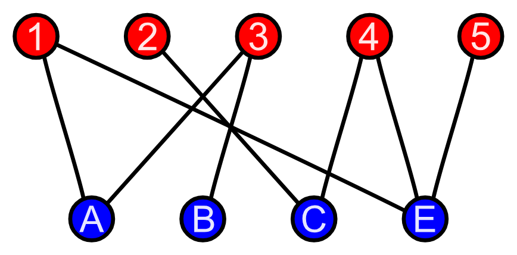

---
tags:
  - graphs
  - bipartite
---
# 2. Check bipartite
Created Tue Jul 16, 2024 at 12:02 PM

## What's a bipartite graph
A graph that can be divided into two groups such that edges connect only the groups among each other and not within themselves.


## Observation
Observe that if 2-coloring is attempted on a bipartite graph (i.e. all neighbors of a node are of different color), then it be possible. For a non bipartite graph it won't be possible.

We can augment breadth-first search so that whenever we discover a new vertex, we color it the opposite of its parent. We check whether any non-tree edge links two vertices of the same color. Such a conflict means that the graph cannot be two-colored. If the process terminates without conflicts, we have constructed a proper two-coloring.

## Implementation
Q: Coloring is OK. But should checking be done during the traversal (aka coloring) phase, or separately?
A: We need to check if 2-coloring is possible or not. In short we only need to detect a problem (same colors are adjacent) and the answer would be no, so can be done in single pass.

## Code
https://leetcode.com/problems/is-graph-bipartite

```js
class Solution {
public:
    bool twoColoringDfs(int start, vector<vector<int>>& graph, vector<int>& vis,
                        int color) {
        vis[start] = color;
        for (auto nbr : graph[start]) {
            if (!vis[nbr]) {
                vis[nbr] = 1 - color;
                if (!twoColoringDfs(nbr, graph, vis, 1 - color))
                    return false;
            }
            if (vis[nbr] == vis[start])
                return false;
        }

        return true;
    }

    bool isBipartite(vector<vector<int>>& graph) {
        // since unconnected, definition of bipartite = all forests should be
        // bipartite
        int V = graph.size();
        vector<int> vis(V, 0);
        for (int i = 0; i < V; i++) {
            if (!vis[i] && !twoColoringDfs(i, graph, vis, 0))
                return false;
        }

        return true;
    }
};
```