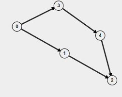

# 3. Cycle detection
Created Tue Jul 16, 2024 at 5:47 PM

## Undirected graphs - DFS
Back edges are the key to finding a cycle in an undirected graph. Cycle detection is based on watching the back edges of DFS. So the forward edge and back-edge-but-parent is benign, but back-edge-not-parent is a cycle. We are just looking for this to happen.

## Directed graphs - DFS with extra array
Cycle detect using DFS on a undirected graph just checks if it encounters an already visited node (not a parent). But it will incorrectly detect a cycle for the below directed graph as well, at node '2'.


The realization here is that not only do we need to encounter a visited node, but it must be in the same path as the current path (i.e. same direction). In the above picture, 0 -> 3 -> 4 -> 2 is one path and 0 -> 1 -> 2 is another, so its not really a cycle. It needs to be a full circle.

Implementation wise, we can just keep an extra array called pathVisited. We will populate the visited array as usual, but for pathVisited we will mark a node as 1 when we start processing the node, and mark it as 0 when we are done processing. This means the descendants will always see their ancestors in the same path as 1, but when the subtree changes, the other subtrees pathVisited would have become 0. If we find pathVisited and visited both to be 1, that means we found a proper cycle.

## Code
https://www.geeksforgeeks.org/problems/detect-cycle-in-a-directed-graph/

```cpp
bool helper(int start, vector<int> adj[], vector<int> & vis, vector<int> & pathVis, int parent) {
	vis[start] = 1;
	pathVis[start] = 1;
	
	for(auto nbr: adj[start]) {
		if (nbr == parent) continue;
		if (vis[nbr] && pathVis[nbr]) return true;
		if (!vis[nbr] && helper(nbr, adj, vis, pathVis, parent)) return true;
	}
	pathVis[start] = 0;
	return false;
}

// Function to detect cycle in a directed graph.
bool isCyclic(int V, vector<int> adj[]) {
	vector<int> vis (V, 0);
	vector<int> pathVis (V, 0);
	// code here
	for(int i = 0; i < V; i++) {
		if (!vis[i] && helper(i, adj, vis, pathVis, -1)) return true;
	}
	return false;
}
```

Minor optimization: instead of two arrays, use a single visited arrays whose values are 0 (undiscovered), 1 (node visited, but path not visited) and 2 (node visited and path visited).