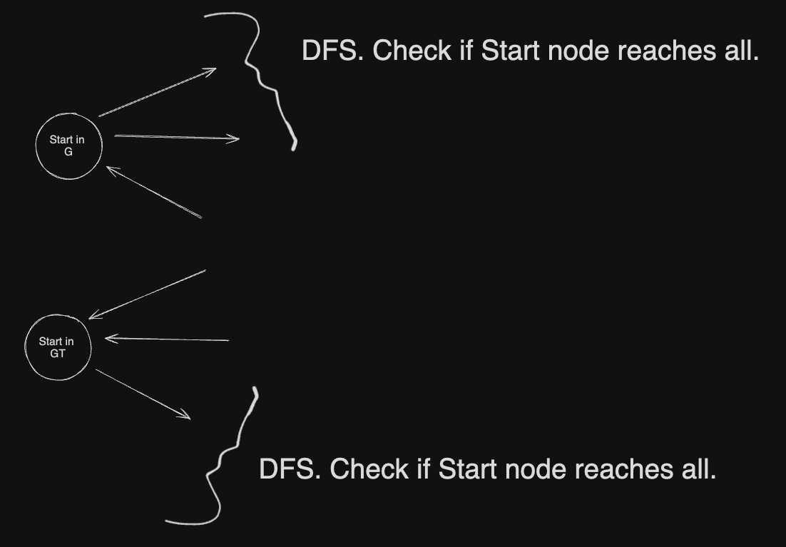

---
tags:
  - graphs
  - connected
---
# 5. Strongly Connected components
Created Wed Jul 17, 2024 at 10:17 PM

## Jargon

- Connected - an undirected graph where there's a path between any two nodes. i.e. No isolated nodes or isolated subgraphs. The term applies only to undirected graphs.
- Weakly connected - a directed graph where there's a path between any two nodes, but only if direction is ignored. The term applies only to directed graphs (means same as connected though).
- Strongly connected - a directed graph where there's a path between any two nodes.
- Strongly connected component - a subgraph (in a directed graph), that's connected (all nodes are reachable to all) and there's no outgoing edge.

## Check undirected/weak connected graph algorithm
Very simple - do a traversal (DFS/BFS) and check if visited list is full. Don't use an envelop for loop here (it must happen in one go).

- Connected - do a DFS/BFS and checking if visited list is full.
- Weakly connected - make the graph undirected by changing the graph representation so that (x, y) and (y, x) are both edges. Then do the DFS/BFS and check if visited is full.
	- Alternatively, do DFS and BFS normally, but in the neighbor step (for loop), for each neighbor, do a DFS for each of its neighbor right there.

  ```py
  def dfs_weakly_connected(graph, start):
    visited = set()

    def dfs(v):
        if v not in visited:
            visited.add(v)
            # Traverse all outgoing edges
            for neighbor in graph[v]:
                dfs(neighbor)
            # normally DFS end here

            # Traverse all "incoming" edges
            for node in graph:
                if v in graph[node]:
                    dfs(node)
  ## main
    dfs(start)
    return len(visited) == len(graph)
  ```


## Check strongly connected graph algo
1. Select a start node.
2. Do a DFS on G and check if all nodes are covered (vis.List = |V|)
3. Do a DFS on G<sup>T</sup> and check if all nodes are covered.

If both are true, then the directed graph is strongly connected.

Efficiency: O(V+E) time and O(V) space. Since just DFSs + transpose is constant op.
### Proof
An amazing idea.

So in first pass, we check if `Start` reaches all. YMBT: but this is just one node, and that too one way.
In second pass, again, we check if `Start` reaches all in G<sup>T</sup>. Which actually means do all nodes reach `Start`.

If both are true we have proven that `Start` reaches all and everyone reaches `Start`. So even if we assume the worst, i.e. lack of any more edges for connectedness, `Start` can act as a common node such that everyone can reach everyone.

Brilliant idea as opposed to enumeration, i.e. DFS for each node V \* (V+E).
An observation that problems exist where a single aspect check is equivalent to 'all-aspect' check.

## Strongly connected components algo
A strongly connected component in a directed algorithm refers to a subgraph that's strongly connected.
Being a strongly connected subgraph may be a little unobvious, so another way to understand SCC is that it's a self-contained cycle.

This uses the intuition of check strong connected graph (i.e. normal and transpose).
See [Kosaraju's Algorithm](../../../../3_CN_Competitive_programming/8._GraphsX/4._Strongly_connected_components.md#Kosaraju's\ Algorithm).
