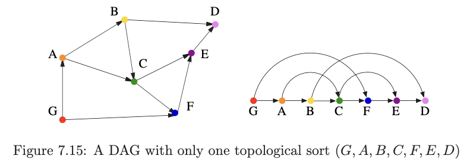
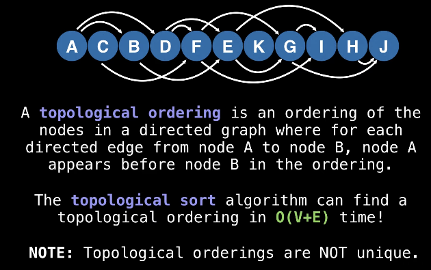

---
tags:
  - graphs
  - topsort
---
# 6. Topological sorting
Created Wed Jul 17, 2024 at 11:16 AM

Source: https://youtu.be/eL-KzMXSXXI?si=vt6YhmMje70VjATv
## #DAG
DAG means a directed acyclic graph, i.e. a graph with no cycles.

Note:
- But doesn't this just mean a tree? no, the directions may be messed up (not all are down), compared to a tree.
- If we ignore the directions, would it be a tree? No, since its directed there could be undirected cycles.
- A tree is a DAG of course. But not all DAGs are trees.
- DAG is applicable to directed graphs only, of course.

## Topological sorting
This is the most important operation on DAGs.
A DAG may have multiple topological sortings. Any DAG has at least one.

### Applications
Many real world situations can be modeled
as a graph with directed edges 
where some events must occur before others.

- Program dependencies
- School class prerequisites
- Event scheduling
- Assembly instructions

Below: G must happen before A.

### What is topological sort (aka top sort)

The above is a fancy way to say the above: top sort is a way to arrange nodes linearly such that all edges are towards the right.

### Implies both ways (A <=> B)
A DAG always has a (atleast one) topological sort.
Also, a graph that has a topological sort is a DAG.

## Topological sort - algorithm
- Do a DFS
- When you find a new node, do the usual.
- When you are done with the nbrs of a node, store the node at the back on an array (this is global and of length V).

The array we have been maintaining is the topological sort. And in order, the leftmost has no parent.

### Why this works?
Remember that top sort means arranging nodes linearly and that all edges are towards the right.
What would be the rightmost node in this arrangement? well it would be a node that has no right edge.
w.r.t to a DAG this means a node that's at the end of a trail (long DFS trail). There could be multiple such nodes. Anyway, the second node would be the parent to the first node. So we know that we start populating the array in the recursion back phase, and also after being done with all neighbors (if we didn't, and inserted ourselves before a neighbor, we would have an edge to the left which would not be a topological sort).

## Using top sort
Lets take example of satisfying dependencies.
- To check feasibility - determine if the graph is DAG or not.
- Doing order (i.e. find an order) - Do work in the topological ordering (left to right). This works because when we arrive at a node, we its dependencies (that would have been to the left) have surely been completed.