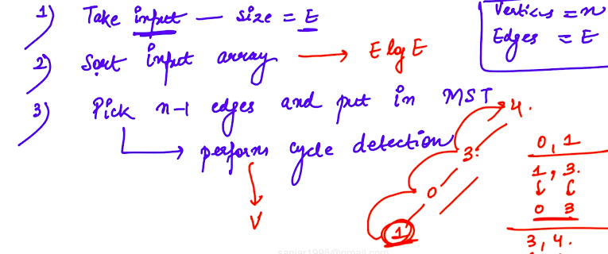

---
tags:
  - graphs
  - mst
---
# 1. Kruskal's Algo Complexity
Created Saturday 25 April 2020

## Approach
Unlike Prim's, which grows one tree, Kruskal's starts with considering each node as a component, and each node (tree) is grown independently.

We add all edges at once into the priority queue, unlike Prims. Then edges are traversed (lowest weight first) and expand the trees. If two nodes are in the same tree, then the edge is rejected (cycle causing), otherwise the edge is accepted (thereby joining two trees).

The algorithm stops when edge count is V-1.
## Algorithm
Idea:
1. Sort the edges according to weights. **Adjacency list will be better here(as it'll store the weights).**
2. Take the edges: source-destination-weight as input.
3. For storing the MST, make a list of n-1 `<edges>`.

**No visited bag required!**
#### Analysis - Time and Space

- Time Complexity is O(VE) using union find.

- We can make it O(E logV) by using Union by rank and Path Compression, i.e we try to make a balanced tree.

s

## Significance
- Better for sparse graphs.
- Uses union-find data structure for isSameTree(u, v) and mergeTree ops.
- Not so simple to code, due to union-find structure.
- Parallelizable.