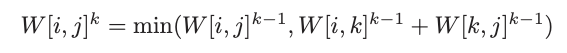

---
tags:
  - graphs
  - named-algo
---
# 2. Floyd Warshall
Created Wed Jul 24, 2024 at 2:05 PM

## Context
Floyd's algorithm is used to find all pairs shortest path, i.e. the shortest distance between any two nodes.
The algorithm exists since applying Dijkstra would be very inefficient, i.e. V \* E logV = VElogV.

The output of Floyd is obviously is a matrix. A minor point here is the default value is Infinity, instead of zero (the usual in an adjacency matrix) for nodes that don't have an edge, since cell value denotes distance.


## Intuition
Floyd's algorithm moves in phases. In the first phase (k=0), no intermediate nodes are allowed, i.e. only direct edges (i.e. path of length 1) are considered. Then k=1 (paths of length 2, i.e. one intermediate node) are considered and so on, until paths of size n-1.

The value are determined using dynamic programming, since adding an intermediary node (say m) is like considering (u to m) and (m to v), that could minimize (u to v). Simple.




## Code
```cpp

```


## Efficiency
O(V<sup>3</sup>) time, O(V<sup>2</sup>) space.

There are V phases, and each cell computation uses values of the previous layer (also ~V), and we compute only the new layer (~V).