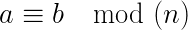

---
tags:
  - num
---
# 1. Modulo operation
Created Tuesday 30 June 2020

**Modulo Operation**

- Simplty asks the remainder when **a** is divided by **n**

remainder when a/n = a mod(n)

---

**Congruence**
This is different from modulo operation. It is actually a comparison operator.
Two numbers **a** and **b **are said to be congruent if they belong to the same bucket.
 iff 

- = and ≡ are different
- Important: a ≡ b mod(n) ↔ -a ≡ -b mod(n)
