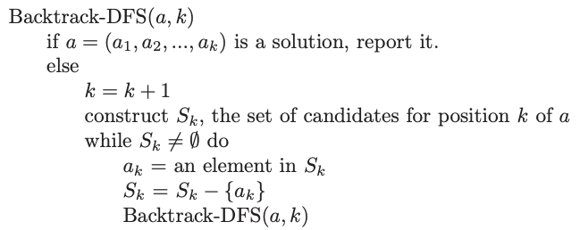
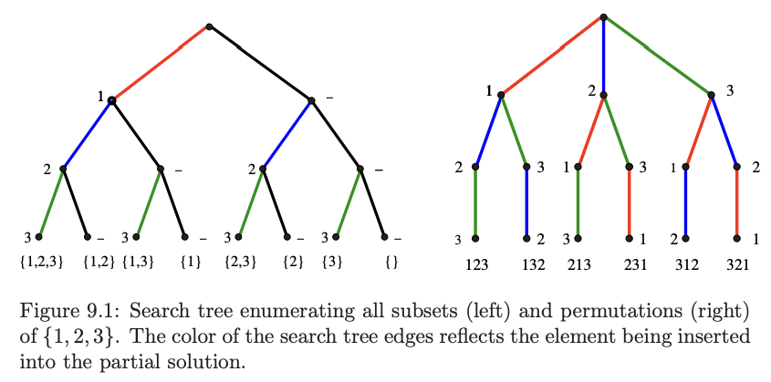
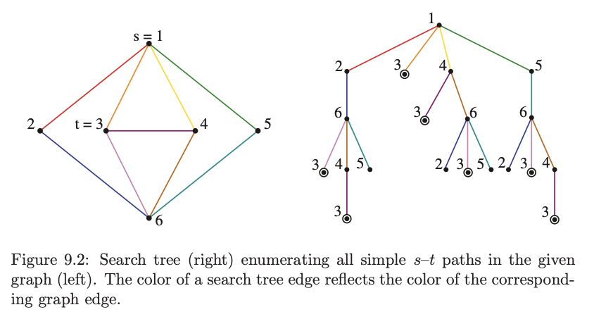

# 1. BackTracking
Created Monday 22 June 2020

## What is backtracking
- Backtracking is an approach where we explore all possible paths efficiently.
- At each step in the backtracking algorithm, we try to extend a given partial solution (e.g. stored as an array) by adding another element at the end. If it's a final solution, we note it down. If its not final, we check if its worth continuing, if no, we stop otherwise we continue extending the solution.

e.g There are 10 bags with some items.
Print the name on the bag if a ball exists in the bag.

- Backtracking is a kind of thinking(approach), not an algorithm.
- Backtracking and recursion are different. Backtracking is an approach and recursion is the algorithm used to solve the problem.
- Backtracking is implemented using recursion.

## General backtracking algorithm (DFS tree)
Backtracking constructs a tree of partial solutions, where each node represents a partial solution, and leaves represent valid/invalid solutions.

This means backtracking is a DFS traveral.

Note:
- We can consider path as BFS too, but its too memory intensive (max children is high) for most problems.

## Backtrack maid
1. We Consider all possibilities.
2. We traverse instead of storing.
3. Define a solution space (array of bools/integers etc). It should be linear fixed size.
4. We maintain read/write mapping between solution space and app's data structure. *Linear (array) is the simplest to advance and backtrack*.
5. On each solution position, generate valid possibilities.
6. Since solution space is shared, we have to do forward (write) and backward (reset) operations for each candidate solution, so the next candidate is unhindered.
7. Backtracking considers all possibilities at every point, so there will be no cycles. *Duplicate solutions may exist, but not cycles*.

Note (non trivial):
- We maintain a linear solution space irrespective of the app's data structure.
- Shared solution space.
- Simple: there may be many (distinct) valid solutions. If you only need one solution stop early.
- Movement in solution space may not be serial, there may be an ordering to it. Still, there's no chance of cycles since we do forward-and-backward-ops for each solution.

## Common backtracking problems
The common thing in all backtracking problems is the "decision you make".
1. All subsets - solution is a boolean array of size "alphabet-size".
2. All permutations - solution is a int array of size "alphabet-size".
3. All paths from source to target in a graph - solution is a int array of size V.

Note:
- Storage - Usually, we want to traverse over all possible solutions, instead of storing them. This may mean keeping a max size array (i.e. max candidate size) and doing operations on it as we traverse through the solution
- Efficient - Backtracking means enumeration, but it should be efficient - we should backtrack as soon as we know forward solutions in the current path are doomed to fail, or have already been seen. i.e. *early backtrack and avoid duplicate is important in backtracking*.
- Order of output - Another thing in backtracking is the order of output - so if the answer needs to be in sorted order, we must use recursion instead of bitwise-gen (suppose problem is subset gen), since recursion maintains sorted order by default.