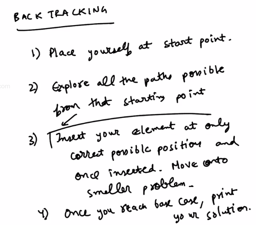

# 1. N Queens Problem - Exercise
Created Thursday 25 June 2020

## N Queens Problem
Given an NxN grid and N queens, following the rules of chess. We need to place the queens such that no queen is able to attack any other queen. Find and print the ways in which this is possible.

How to approach this problem:

1. Place the queens one by one.
2. After placing some queens, place a queen out from the killzone of the queens.
3. If a queen becomes unplaceable, change the queen which came before this - the previous queen caused the problem.
4. Keep doing this until we are able to place the queens effectively. We can confirm a configuration if all queens are placed correctly.
5. **Backtrack** even after a successful config. See what is possible, if the current queen was not placed here. **Do** Mark the current as marked.

Note: We end the search when we have seen all initial configurations.

---

- For solving a problem which involves backtracking, first solve an example(not a very trivial one), then generalize.

## Statement
You are given N, and for a given N x N chessboard, find a way to place N queens such that no queen can attack any other queen on the chess board. A queen can be killed when it lies in the same row, or same column, or the same diagonal of any of the other queens. You have to print all such configurations.
**Input Format :**
Line 1 : Integer N
**Output Format :**
One Line for every board configuration. 
Every line will have N*N board elements printed row wise and are separated by space
Note : Don't print anything if there isn't any valid configuration.
**Constraints :**
1<=N<=10
**Sample Input 1:**
4
**Sample Output 1 :**
0 1 0 0 0 0 0 1 1 0 0 0 0 0 1 0 
0 0 1 0 1 0 0 0 0 0 0 1 0 1 0 0 

*****

[nqueens.cpp](nqueens.cpp)

**Q) **Why don't we try all the places, and start from the first row.
**A)** We can do anything systematic if we are exploring all paths. It does not matter.

