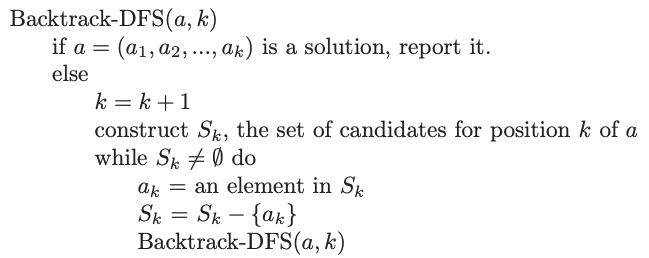

# 1. BackTracking
Created Monday 22 June 2020

## Lecture
- Backtracking is an approach where we explore all possible paths.

e.g There are 10 bags with some items.
Print the name on the bag if a ball exists in the bag.

- Backtracking is a kind of thinking(approach), not an algorithm.
- Backtracking and recursion are different. Backtracking is an approach and recursion is the algorithm used to solve the problem.
- Backtracking is implemented using recursion.

## Types of backtracking problems
The common thing in all backtracking problems is the "decision you make".
1. Subset generation - to include given element or not, at the moment.
2. Permutation gen - "which element" to choose, at the moment.

Another thing in backtracking is the order of output - so if the answer needs to be in sorted order, we must use recursion instead of bitwise-gen (suppose problem is subset gen), since recursion maintains sorted order by default.

## N Queens Problem
Given an NxN grid and N queens, following the rules of chess. We need to place the queens such that no queen is able to attack any other queen. Find and print the ways in which this is possible.

How to approach this problem:

1. Place the queens one by one.
2. After placing some queens, place a queen out from the killzone of the queens.
3. If a queen becomes unplaceable, change the queen which came before this - the previous queen caused the problem.
4. Keep doing this until we are able to place the queens effectively. We can confirm a configuration if all queens are placed correctly.
5. **Backtrack** even after a successful config. See what is possible, if the current queen was not placed here. **Do** Mark the current as marked.

Note: We end the search when we have seen all initial configurations.

---

- For solving a problem which involves backtracking, first solve an example(not a very trivial one), then generalize.

## Major issues
- Outside food not allowed (cannot do Swiggy/Zomato) ^^, not mentioned in policy
- Bedsheets not clean, hair on bedsheets
- Room too small, unfurnished rooms, paint falling off, dusty
- No towel, soap, toiletries provided. Got them upon asking, but towels smelled too bad. Tiny soap provided.
- AC not working - when complained, the manager said he’ll send somebody in 10 mins, the guy came after 2 hours (had to call 5 times)
- TV does not work

## Minor
- Improper board sign outside (it said Krishna hotel, not Fab Krishna)
- Food menu too expensive