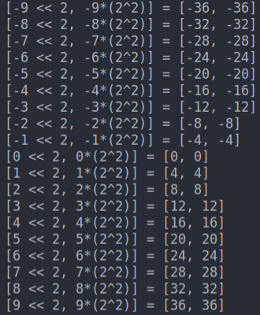

---
tags:
  - bitman
---
# 1. Shift Operators
Created Sunday 28 June 2020

The basic ops for bits are shifts, there are two kinds:

### Left shift

- Left most bit(s) are lost.
- Value added to the right are zeroes(0), always.
- Syntax:

```cpp
x << 1;
2 << 1;
```


- Significance of left shift: Multiplication by 2^k^.



### Right shift

- Right most bit(s) are lost.
- Value added to the left is 0 for positive and 1 for negative, i.e sign retained.
- Syntax:

```cpp
x >> 1;
8 >> 1;
```

 

- Significance of right shift: Division by 2^k^, **floor** value.


---

Note: Shift behaves the same in all languages, because shifting is mathematical.
