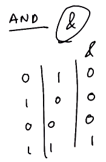
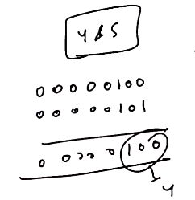
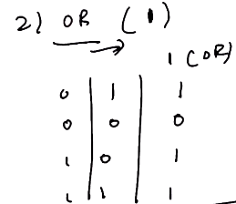
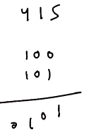
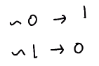
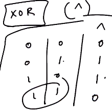
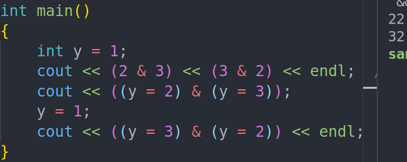

---
tags:
  - bitman
---
# 2. Remaining Bitwise Operators
Created Sunday 28 June 2020

- **Bitwise ops: **The operators which perform the logical gate operations on corresponding bits of two variables.

**Note:**

1. These are different from &&, || and ! which are meant for booleans only.
2. All 4 ops are commutative, associative and distributive.

Types of gate bitwise ops:

1. AND ⇒ &

 

- Uses:
  1.  Turn off bit
  ```cpp
  x & 0 == 0; //true for any number
  // e.g 110 , turn off second bit
  // 110 & 101
  ```

2. Check if bit is set/unset, inter-alia check if even or odd(no shifts required)

   ```cpp
   x & 1 = x; // check if a bit is set/unset
   ```

3. OR ⇒ |

 

- Use:
  1.  Set bit(s)
  ```cpp
   x | 0 == x; // true
   // 1010, turn on bit 1
   // 101 | 0100 = 1110
  ```

2. Check if bit is set/unset

   ```cpp
   x | 0 = x; // x is a bit
   ```

3. NOT ⇒ ~ ⇒ unary operator



- Use:

  1.  Unset bit(s)
  2.  Produce all 1's

  ```cpp
  ~0;// 11111111... useful
  0; // 0000.. obvious
  ```

- Interesting and useful fact:
  ```cpp
  ~x == -(x+1); // follows from the definition of 2's complement, given x is an integer
  ```

4. XOR ⇒ ^ (The most useful)



- Use
  1.  Check if two bits are equal
  ```cpp
  x ^ x == 0; // works for only two numbers(or even numbers)
  ```

2. Works as binary switch for any bit
   ```cpp
   x ^ 1 = ~x; // same as ~x
   ```

---

1. **Predict The Output**

```cpp
#include<iostream>
using namespace std;
int main(){
	if(~0 == 1) {
		cout << "yes";
	}
	else {
		cout << "no";
	}
}
```

1. yes
2. no
3. Compile time error
4. Undefined

Answer: B. ~0 = -(0+1) = -1 and not 1. Bitwise. not !

2. **Predict The Output**

```cpp
#include <iostream>
using namespace std;
int main(){
    int y = 0;
    if(1 | (y = 1)) {
        cout << "y is " << y;
    }
    else {
        cout << y;
    }
}
```

1. y is 0
2. y is 1
3. 1
4. 0

Answer: B. Because in C++ an assigment has a value equal to the rvalue. So y==1 is the same as 1. This is allowed only in low level languages.

3. **Predict The Output**

```cpp
#include <iostream>
using namespace std;

int main(){
   int y = 1;
   if(y & (y = 2))
      cout << "true";
   else
   cout << "false";
}
```

Answer: true

Reason: 32 is the answer in the assigment because no buffer is created.
in 2 & 3 ⇒ 2 and 3 both have different buffer variables.
in (y=2) & (y=3) ⇒ there are no buffer variables created, this is how assignment operator works. So is is like 3 & 3.
in (y=3) & (y=2) ⇒ 2 & 2
