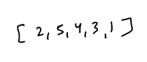

# 2. More about Bitmasking

Created Tuesday 28 July 2020

Suppose we are given this array:

,we need to return the subsets which sum to k.

- Naive way is to generate the subsets, is using recursion.
	- But recursion has a pro, that bit-gen does not: if your output must be in sorted order, then using recursion is better. In the bit-step, you may need to explicitly sort the output before returning.
- But if we use bitmasking, we already have all our subsets. We can do **for(i=0; i < (1<<n)-1; i++)** and get our value, this requires no extra memory, but the time complexity is the same(although constant factor is much smaller). Check ith bit is also very easy, (mask & 1<<i\==1). See a problem solved using [bit-based-subset](https://www.interviewbit.com/problems/subset/) and [related-video](https://www.youtube.com/live/fUJt4mEROMA?si=wBwx_vs9xbJQ09_I&t=939).
	```js
	module.exports = {
	  //param A : array of integers
	  //return a array of array of integers
	  subsets: function (A) {
	    A.sort((a, b) => a - b); // sort before hand to avoid sorting all subsets
	    const numberOfSubsets = Math.pow(2, A.length);
	    const bag = new Array(numberOfSubsets).fill(null);
	
	    // bitwise gen and use as boolean-include
	    for (let i = 0; i < numberOfSubsets; i++) {
	      const currentSubset = [];
	      // look at each bit
	      let bits = i;
	      let idx = 0;
	      while (bits) {
	        const bit = bits & 1;
	        bits = bits >> 1;
	        if (bit) currentSubset.push(A[idx]);
	        idx += 1;
	      }
	
	      bag[i] = currentSubset;
	    }
	
	    // inter-subset sort
	    bag.sort((a, b) => {
	      let i = 0;
	      while (i < a.length && i < b.length && a[i] === b[i]) i++;
	      return i < a.length && i < b.length ? a[i] - b[i] : a.length - b.length;
	    });
	    return bag;
	  },
	};
	```
- We avoided recursion and did it iteratively. Complexity n.2^n^, works if n<=16.


- The real power is comes when we use Dynamic Programming with Bitmasking.
