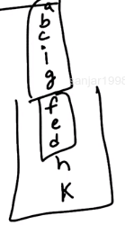

# 4. Strongly connected components

Created Sunday 26 July 2020

- A directed graph is said to be **strongly connected** if there's a path between all pairs of vertices.
- strong connectedness is valid only for directed graphs.

## Strongly connected component (SCC)

An SCC is a **maximal strongly connected subgraph**.

In other words: A connected subgraph where all pairs of vertices have a path between them, such that no larger(i.e containing more vertices) connected subgraph is possible containing the same vertices.

SCCs can be thought of as **self-contained** **cycles**.

Example of SCCs

Note:

- A single vertex is considered strongly connected.
- Each strongly connected component is actually a DAG.

### Kosaraju's Algorithm - find all SCCs in a graph

1. Perform DFS and store completely visited vertexes in a stack (i.e. during the backtrack step after neighbors, for each node).
2. [Transpose](https://en.wikipedia.org/wiki/Transpose_graph) the graph(All in-edges become out-edges and vice-versa).
3. Perform DFS with stack's top node as the start node. When the DFS ends, all visited until now are SCC. Continue the envelop loop, and you'll discover more SCCs. You can use the same visited no problems.

## Intuition

1. We do normal DFS first, which forms the DFS tree (trail). Obviously the first element that we backtrack from (i.e. last node of first trail) has no children. OTH, the nodes that we backtrack from later have children in DFS tree. _I know that there can be many same level trails, but it doesn't matter, DFS will cover all neigbours of the last node in a trail for sure, before backtracking_.
2. Also during DFS we keep pushing nodes into a stack. As explained above \^ the node at top will be the start node, and at the bottom will be some last node.
   
3. Our tree will start look like so. In other words the stack is made of of layers, each layer corresponding to an SCC. They are not strictly ordered, but its guaranteed that a layer consists of nodes only from the same SCC. Why: we are at a node in an SCC, two cases are possible:
   1. We explore all neighbors before moving out (the SCC). Eventually we will move outwards and keep going (i.e. without a backtrack).
   2. Move out of the SCC first, and visit the neighbors afterwards. Eventually we will move outwards and keep going (i.e. without a backtrack).
   - So in both cases we move outward without backtracking, i.e. identical trail. This means we will push the nodes of current SCC only during the backtrack step, and all will backtrack before current node, and after outnodes. In other words they will be in one layer.
   - Non linear SCC diagram - Note that that there may be multiple out edges, but this is fine, since outside SCC's (unexplored) will still be below and current SCC will be above them in the stack.
   - The series of SCC could have edges going in or out, and not necessarily all the way in a line. In other words, the graph may not be fully connected, but the envelop loop will still take care of this, and one stack is still fine, since graphs will be stacked one over the other, which is fine.
4. When we transpose, all outgoing edges become incoming. And we start from the same start node (stack.top() is start node), this means the DFS will now happen as if all SCC's are disconnected components. Thereby enumerating all SCCs.
   
   
5. Due to the envelop loop, we will try some other subgraph and do the same.


## Efficiency
Same as DFS

O(V+E), O(V)
## Code

[Problem](https://www.geeksforgeeks.org/problems/strongly-connected-components-kosarajus-algo/1)

```cpp
class Solution
{
	public:
	//Function to find number of strongly connected components in the graph.
	void transposeGraph(int V, vector<vector<int>>& adj) {
	    vector<vector<int>> adjT (V, vector<int>());
	    for(int i = 0; i < V; i++) {
	        for(auto nbr: adj[i]) {
	            adjT[nbr].push_back(i);
	        }
	    }

	    // copy to adj
	    for(int i = 0; i < V; i++) {
	        adj[i].resize(adjT[i].size());
	        int count = 0;
	        while (count != adjT[i].size()) {
	            adj[i][count] = adjT[i][count];
	            count++;
	        }
	    }
	}

	void dfs(int start, int V, vector<vector<int>>& adj, vector<int>& vis,
	stack<int>& stk, bool endPhase)
	{
	    vis[start] = 1;

	    for(auto nbr: adj[start]) {
	        if(!vis[nbr]) dfs(nbr, V, adj, vis, stk, endPhase);
	    }

	    if (!endPhase) stk.push(start);
	}

    int kosaraju(int V, vector<vector<int>>& adj)
    {
        vector<int> vis (V, 0);
        stack<int> stk;
        for(int i = 0; i < V; i++) {
            if(vis[i]) continue;

            dfs(i, V, adj, vis, stk, false);
        }

        // clear visited for new traversal
        for(int i = 0; i < V; i++)
            vis[i] = 0;
        transposeGraph(V, adj);
        int count = 0;
        while(!stk.empty()) {
            int i = stk.top();
            stk.pop();
            if(vis[i]) continue;

            dfs(i, V, adj, vis, stk, true);
            count++;
        }

        return count;
    }
};
```
