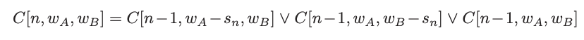

# 3. Knapsack or subset sum
Created Thu Aug 8, 2024 at 9:46 PM

## Statement
The knapsack or subset sum problem asks whether there exists a subset S of
an input multiset of n positive integers S = {s1,...,sn} whose elements add up
a given target k.

 Think of a backpacker trying to completely fill a knapsack of capacity k with possible selections from set S.

Applications of this important problem are discussed in greater detail in Section 16.10.

## Solution
Recurrence relation is
`f(i, w) = f(i-1, w - arr[i]) || f(i-1, w)` (choose or not)
f = is a subset sum possible over sum `w` ending at index `i`

i-1 varies linearly, but sum can be anything (suppose the subset if of binary numbers - i.e. any number can be represented, so all possible subtractions can be made), so `w` also varies linearly.

Storage and time both are is `nW`. Recursion space is O(n) since we hit base case as soon as i = 0, so its already subsumed by dp storage (asymptotically).

## Removing the recursion (CHECK once)
Not possible, since we need to represent all numbers, and there's no order.

## P=NP proved?
The subset sum is a "NP-complete algorithm" but we seem to have come up with a polynomial solution. How?

Actually we haven't. Storing k needs log(k) bits, so our solution is actually exponential. This is similar to the reason why factoring a number n by checking 2 to sqrt(n) is also not polynomial, since representing n requires O(logN) bits.

If this is not convincing. just considers what happens if we multiply all subset elements by a large number, say 1 million. Such a transform wouldn't have affected sorting or MST algos or most algorithm we have studied, in general. But the current algo would be affected significantly. i.e. the range of numbers matters in subset sum problem, which is hard for large integers.

## War Story: The Balance of Power
An electric company wanted an algorithm that distributes load across 3 phases such that load on each phase is the same (as much as possible).

The data is a list of house usage at a given hour. Assume it remains fixed for an hour.

Lets solve a simpler problem. What if there were just two phases. All we'd need to do is find a subset whose sum is 1/2 the total. That would become a phase, and the remaining houses would become the other phase.

Generalizing this to 3 phases is not an issue (as per Skiena).

So we can use subset-sum (aka 0-1 knapsack) to solve it via DP.

C = "true if there is a way to partition the first n loads of S such that the weight on phase A is wA and the weight on phase B is wB." We need the value of `C[n, total/3, total/3]`.

The solution is nk2 both storage and time.

- Binning the loads by 1/10 helped (divide and floor), it reduced the running time by 100.
- Additionally, the company wanted to minimize switching the phase a house was on. The same solution, with a small tweak solves that as one - we add +1 for each switch (i.e. insert of a house into another phase).
  

*That is the power of dynamic programming. Once you can reduce your state space to a small enough size, you can optimize just about anything. Just walk through each possible state and score it appropriately.*