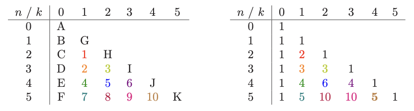

# 10. Dynamic Programming
Created Tue Aug 6, 2024 at 8:46 PM

## Context
- The most challenging algorithmic problems involve optimization
- Optimization problem (algorithms) should:
	- Always return best solution
	- Be efficient
- Considered known approaches and outcomes:
	- Greedy algorithms make best local decision. They are efficient but don't guarantee global optima.
	- Exhaustive search (like backtracking) try all possibilities. They are quite inefficient but return global optimal.

## DP
DP combines the best of both worlds. Here we search all possibilities (guaranteeing correctness) and store intermediate results (for efficiency) to avoid recomputing. By storing the ***consequences*** of all possible decisions and using this information in a systematic way, the total amount of work is minimized.

## Info about DP
- DP requires seeing that a naive recursive algorithm computes the same subproblems over and over and over again. So we store results. Only after we have a correct recursive algorithm can we worry about speeding it up by using a results matrix. Drawing recursion trees helps.
- DP is generally the right method for optimization problems on combinatorial objects that have an inherent left-to-right order among components. Left-to-right objects include strings, integer sequences, rooted trees and polygons.
- Dynamic programming is essentially a tradeoff of space for time.
 
  

- After you understand it, dynamic programming is probably the easiest algorithm design technique to apply in practice. That said, until you understand dynamic programming, it seems like magic.
- Dynamic programming is best learned by carefully studying examples until things start to click.

## Memoization
Fibonacci example. Exponential algorithm if recursive definition is used. To speed this up, we store the results in an array indexed by the parameter k in F(k). Time taken drops to linear.

Take home lesson: Caching of the results of recursive calls provides most of the benefits of DP, usually including the same running time as the more elegant full solution.

Note:
- Distinct parameters - In principle, such caching can be employed on any recursive algorithm. However, storing partial results would have done absolutely no good for such recursive algorithms as quick-sort, backtracking, and depth first search because all the recursive calls made in these algorithms have **distinct** parameter values.
- Storage space - Caching makes sense only when the space of distinct parameter values is modest enough that we can afford the cost of storage. Since the argument to the recursive function fib(k) is an integer between 0 and n, there are only O(n) values to cache. Usually if all possible params is O(kp) than caching is feasible.

## Removing recursion
Specifying order - we can get rid of recursion in fibonacci problem by explicitly specifying the order of evaluation of the recurrence relation.  Holds for any problem, if we can specify order, then we don't need recursion.

## Example: nCk
We can do this by the formula by calculating factorials. But suppose we don't have factorial function available.

We think DP may be possible. So we start by thinking of a recurrence relation. What is nCk. Its the count of all possible subsets of selecting at most k things from n given things.

*Since DP is about storing consequences, we think what simplest consequences are related to nCk. We make a story here.* Among all subsets that nCk represents, some may have a given element, and some may not, i.e. boolean consequences. Those subsets that have this given element need to choose k-1 from n-1. And those that don't have it, need to choose k from n-1. Since the possibilities are exhaustive, we can say nCk = (k-1, n-1) + (k-1, n).

We have our recurrence relation. We try to order the evaluation, and can see that an explicit order is possible. Letter represent path of evaluation, right side is values. *We don't need (n, k-1) and only need (n-1, k) and (n-1, k-1), i.e. so is is linearizable*.

## Applying DP
There are three steps involved in solving a problem by dynamic programming:
1. Make a recurrence relation or recursive algorithm. *This in inductive, any story would do*.
2. Storage - Show that the number of different parameter values taken on by your recurrence is bounded by a (hopefully small) polynomial.
3. Remove recursion - Specify an evaluation order for the recurrence so the partial results you need are always available when you need them.