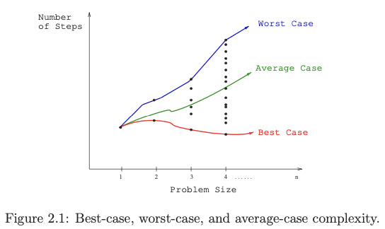

---
tags:
  - dsa-model
---
# 1. RAM model of computation
Created Sat May 4, 2024 at 5:41 PM

> [!NOTE] Take-Home Lesson
> Algorithms can be understood and studied in a language and machine-independent manner.
## RAM model
Machine-independent algorithm design depends upon a hypothetical computer called the Random Access Machine, or RAM.

Under this model of computation, we are confronted with a computer where:
- Each simple operation (+, \*, –, =, if, call) takes exactly one time step.
- Loops and subroutines are not considered simple operations. Instead, they are the composition of many single-step operations. It makes no sense for sort to be a single-step operation, since sorting 1,000,000 items will certainly take much longer than sorting ten items. The time it takes to run through a loop or execute a subprogram depends upon the number of loop iterations or the specific nature of the subprogram.
- Each memory access takes exactly one time step. Furthermore, we have as much memory as we need. The RAM model takes no notice of whether an item is in cache or on the disk.

Under the RAM model, we measure run time by counting the number of steps an algorithm takes on a given problem instance.

## Reliability of the RAM model
The RAM is a simple model of how computers perform. Yes, it is actually true that addition is much faster than multiplication, fancy compiler loop unrolling and hyper-threading may make loops much faster. But still, the RAM proves an excellent model for understanding how an algorithm will perform on a real computer. It strikes a fine balance by capturing the essential behavior of computers while being simple to work with. We use the RAM model because it is useful in practice

It is difficult to design an algorithm where the RAM model gives you substantially misleading results. The robustness of this model enables us to analyze algorithms in a machine-independent way.

## Best-Case, Worst-Case, and Average-Case Complexity
The RAM model helps us in calculating the number of steps an algorithm will take.
But to judge how good (or bad) an algorithm is, we must know how it works over *all* possible input instances. The notions of best, worst and average cases (for a given input size n) helps in this regard.

- The worst-case complexity of the algorithm is the function defined by the maximum number of steps taken in *any instance of size n*. This represents the curve passing through the highest point in each column. **Most useful**
- The best-case complexity of the algorithm is the function defined by the minimum number of steps taken in *any instance of size n*. This represents the curve passing through the lowest point of each column.
- The average-case complexity or expected time of the algorithm, which is the function defined by the average number of steps over all *instances of size n*. **Useful for randomized algorithms (i.e. algorithms that use a random number to make decisions internally).**

Note: all 3 notions are calculated for the same input size n (this avoids bad notions like taking worst case time of the smallest input). Usually we assume `n` to be a large number, so there's just one instance each of these notions.
