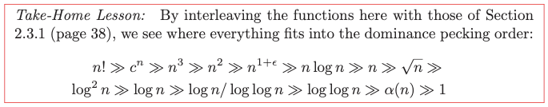

---
tags:
  - dsa-model
---
# 10. Advanced Analysis
Created Tue May 7, 2024 at 11:20 AM

## Esoteric Functions
- Inverse Ackermann’s function f(n) = α(n).
- f(n) = log(logn). One natural example of how it might arise is doing a binary search on a sorted array of only lg n items.
- f (n) = log n/ log(log n).
- f(n) = log2n. Example: we were doing a binary search on n integers, where each one of them was in range 1 to n2. Seeing at a very low level, we have to scan log(n) times, and considering each number takes log(n) time, so logn \* log n. Also, the “log squared” function typically arises in the design of intricate nested data structures, where each node in (say) a binary tree represents another data structure, perhaps ordered on a different key.
- f(n) = sqrt(n). Similar to a d-dimensional hypercube of length n1/d on each side has volume n.
- f(n) = n(1+ε). Epsilon (ε) is the mathematical symbol to denote a con- stant that can be made arbitrarily small but never becomes zero. Such a expression comes into where there are two sub-expressions involved, like 2c · n(1+1/c), where c can be chosen to be anything. But if we try to make c fixed, say a large value, then the first term will become very large. So, the only option is to let the parameter c be included in the expression, and leave the choice of c to be decided by the user of the expression.

## Limits and dominance relations
The dominance relations (classes) we discussed earlier can be proven (i.e. the comparisons can be proven using limits, as in calculus). We just divide the smaller by the claimed larger and put n -> Infinity. If it comes out to be zero, the comparison holds.

