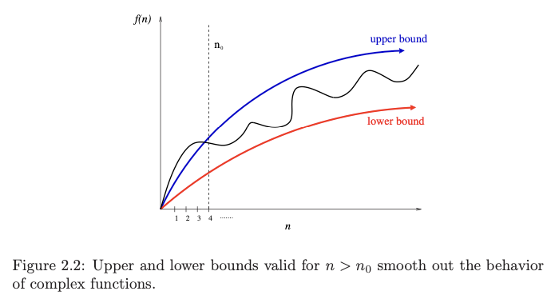
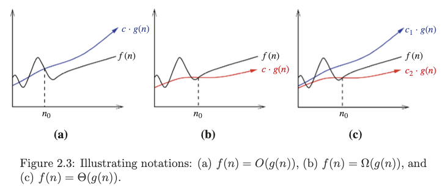

# 2. Big Oh notation
Created Sat May 4, 2024 at 5:54 PM

> [!NOTE] Take-Home Lesson
> The Big Oh notation and worst-case analysis are tools that greatly simplify our ability to compare the efficiency of algorithms.

## Why Big-Oh
The worst, best or average case, are mathematical functions over the input size.
However, it's difficult to work precisely with these functions, because they tend to:
1. Have too many bumps. Explain by example - a binary search works a bit faster is the size of the array is n=2k-1 (where k is an integer), because array partitions work out nicely. This detail is not very important, but it does hint that the mathematical function may be too complicated, with little bumps up and down.
2. Difficult to specify precisely - coming up with a complicated worst case like
	T(n) = 12754n2 + 4353n + 834lg2n + 13546
	would almost do away gains we had with simplicity of the RAM model, and we'd actually be doing the same work as if the program was machine dependent (since we would consider so much detail). But we can observe that algorithm grows "quadratically with n". Other parts are cumbersome and not helpful.

This means that it's much easier to talk in terms of upper and lower bounds of total steps taken (i.e. of a mathematical function).

## 3 notations
There are 3 variations of the notation:
- Oh (maid big): f(n) = O(g(n)) means c · g(n) is an upper bound on f(n). Thus, there exists some constant c such that f (n) ≤ c · g(n) for every large enough n (that is, for all n ≥ n0, for some constant n0).
- Sigma (maid small): f(n) = Ω(g(n)) means c·g(n) is a lower bound on f(n). Thus, there exists some constant c such that f(n) ≥ c · g(n) for all n ≥ n0.
- Theta (maid middle line, i.e. between): f(n) = Θ(g(n)) means c1 · g(n) is an upper bound on f(n) and c2 · g(n) is a lower bound on f(n), for all n ≥ n0. Thus, there exist constants c1 and c2 such that f(n) ≤ c1 ·g(n) and f(n) ≥ c2 ·g(n) for all n ≥ n0. This means that g(n) provides a nice, tight bound on f(n).

Note:
- We are not concerned with small values of n. We are only concerned with large values, the smallest of them being n0.
- Even though bounds can be anything after a given value, we should try to have tight bounds.

