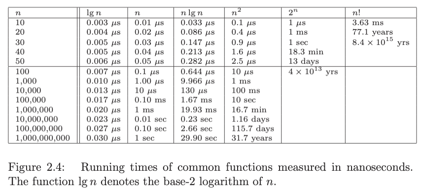
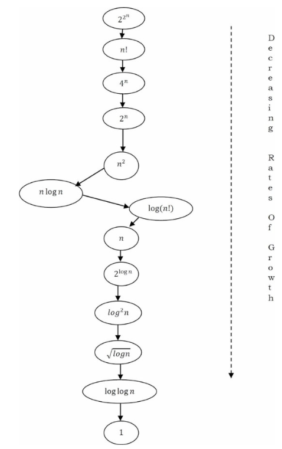

# 3. Growth rates and dominance relations
Created Sat May 4, 2024 at 6:27 PM

## Growth rate for common functions

- Algorithms whose running time is 2n become impractical for n > 40.
- Quadratic-time algorithms, whose running time is n2, remain usable up to about n = 10,000, but quickly deteriorate with larger inputs. They become hopeless for n > 1,000,000 (million)
- Linear-time and n lg n algorithms remain practical on inputs of one billion items.
- An O(lg n) algorithm can work on any imaginable value of n.

## Dominance relations
There are some common function that come up a lot when doing basic complexity analysis. These functions have different growths. The notation `>>` means the function belong to a different class (of higher growth rate). 

The list is:
- *Constant functions*, f(n) = 1: Such functions might measure the cost of adding two numbers, printing out “The Star Spangled Banner,” or the growth realized by functions such as f(n) = min(n,100). In the big picture, there is no dependence on the parameter n.
- *Logarithmic functions*, f (n) = log n: Logarithmic time complexity shows up in algorithms such as binary search. Such functions grow quite slowly as n gets big, but faster than the constant function (which is standing still, after all.
- Linear functions, f(n) = n: Such functions measure the cost of looking at each item once (or twice, or ten times) in an n-element array, say to identify the biggest item, the smallest item, or compute the average value.
- *Superlinear functions*, f(n) = nlgn: This important class of functions arises in such algorithms as quicksort and mergesort. They grow just a little faster than linear, but enough so to rise to a higher dominance class.
- *Quadratic functions*, f(n) = n2: Such functions measure the cost of look- ing at most or all pairs of items in an n-element universe. These arise in algorithms such as insertion sort and selection sort. Shortest path between two nodes in a graph.
- *Cubic functions*, f(n) = n3: Such functions enumerate all triples of items in an n-element universe. These also arise in certain dynamic programming algorithms. Matrix multiplication also has cubed.
- *Exponential functions*, f(n) = cn for a given constant c > 1: Functions like 2n arise when enumerating all subsets of n items. Or Tower of Hanoi problem. As we have seen, exponential algorithms become useless fast, but not as fast as. . .
- *Factorial functions*, f(n) = n!: Functions like n! arise when generating all permutations or orderings of n items.

