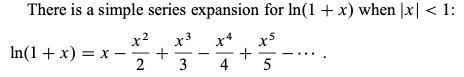

---
tags:
  - dsa-model
---
# 6. Summations
Created Tue May 7, 2024 at 10:53 AM

## Common math
1. Σ 1(a to b) = b-a+1 (inclusive)
2. AP: 1 + 2 + 3 + ... + n = n \* (n+1) / 2
3. GP: 1 + x + x2 + x3 + ... + xn-1 = (xn - 1)/(x-1)
4. HP: 1 + 1/2 + 1/3 + 1/4 + ... + 1/n ~= log(n)
5. log1 + log2 + log3 + ... + log(n) ~= nlog(n)
6. 1 + 2p + 3p + ... + np ~= np+1/(p+1)
7. 