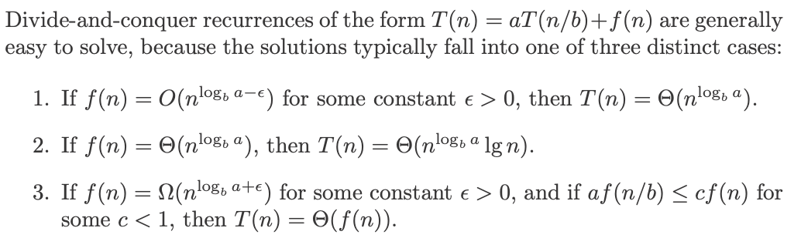
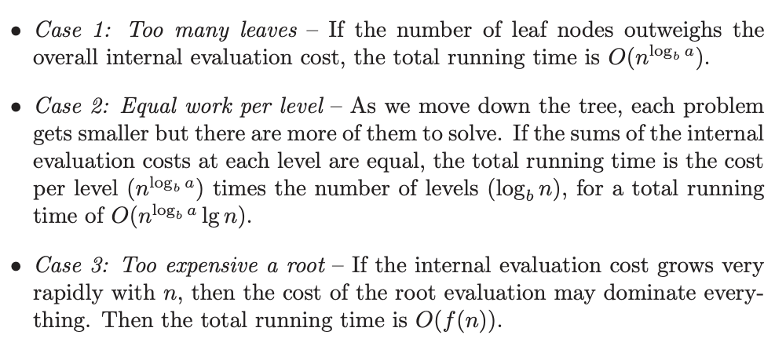

# 2. Recurrence relations
Created Mon Jul 29, 2024 at 10:59 PM

- Needed for checking applicability of DnC
- Useful in general

## Polynomials as recurrences
Any polynomial can be represented as a recurrence relation. *Proof: TBD*.

How do you get the recurrence relation? We are given f(x) = Σaixi.
We try to expand f(x), f(x-1), f(x-2)... and try to eliminate variable `x`. Finally we rearrange the equation to f(x) = something in terms of f(x-1), f(x-2) and so on.

Why do this? This helps us calculate f(x) in a "rolling computation" instead of "direct evaluation". This is exactly what dynamic programming also does.

## Weird functions as recurrences
A lots of weird functions that cannot be easily described using conventional
notation can be represented naturally by a recurrence. Like the factorial notation.

## Examples of recurrence relations
1. Mergesort. T(n) = 2T(n/2) + O(n) = O(nlgn)
2. Binary search. T(n) = 2T(n/2) + O(1) = O(lgn)
3. Fast heap construction. T(n) = 2T(n/2) + log(n) = O(n). Here we build two n/2 heaps and then merge them. We do this at all levels.

Solving a recurrence means finding a nice closed form describing or bounding
the result.

## Master theorem intuition

if you make the recursion tree, is actually just:
