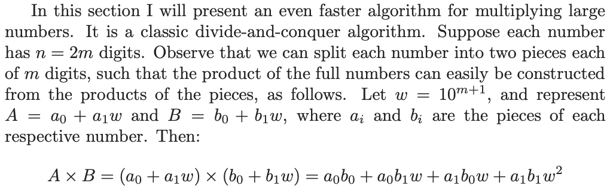
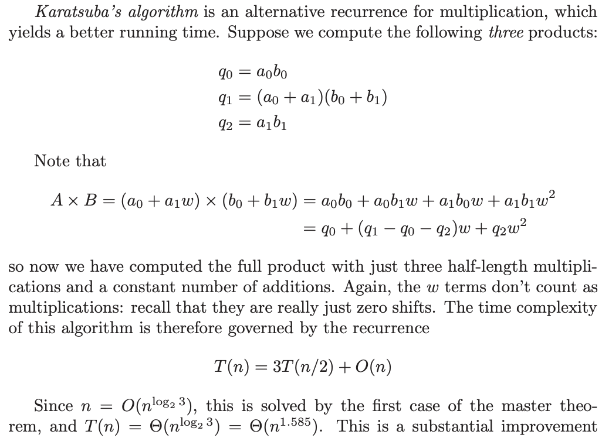

# 3. Fast multiplication
Created Mon Jul 29, 2024 at 11:59 PM

## Karatsuba's algorithm
We want to multiply two numbers, and we're using digit by digit (and have a times table). The complexity would be O(n2).

Complexity is O(n1.58)

Note:
- Strassens algo for nxn matrix multiplication is similar. Theoretical O(n2.81), current best O(n2.37)