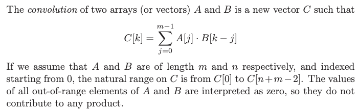

---
tags:
  - dnc
---
# 6. Convolution
Created Tue Jul 30, 2024 at 12:30 AM

## What is a convolution

Convolutions often arise when you are trying all possible ways of doing things that add up to k, for a large range of values of k, or when sliding a mask or pattern A over a sequence B and calculating at each position.

## Speedup
It turns out one can do convolution in nlogn instead of n2 time. Kind of like sorting (squared to linearthmic)

## Applications of convolution
- Polynomial multiplication
- Integer multiplication faster than Karatsuba
- Cross-correlation - helps find out displacement between two time series A and B. Used in purchase vs advertising expenditure.
- Moving average filters - smoothing time series data by average over a window.
- String matching - not optimal but we can solve in nlgn. Need to binary encode characters however. Not the most efficient but showing that DnC works.
- Fast Polynomial Multiplication -  Any polynomial can be represented as a set of points. Its easier to work with points, and DnC becomes applicable. We can do in nlgn instead of n2

*Fast convolution solves many important problems in O(n log n). The first step is to recognize your problem is a convolution.*