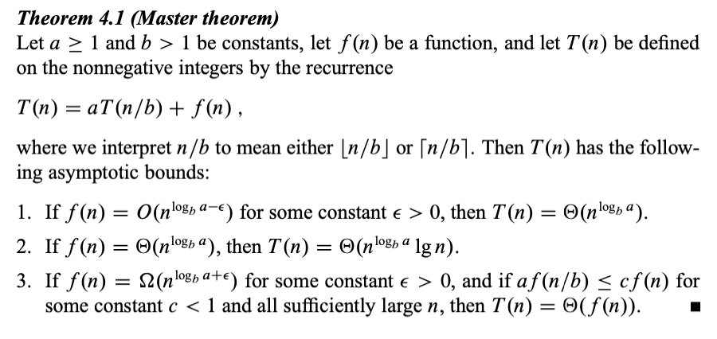

# Recurrence equations
Created Thu May 9, 2024 at 7:34 AM

This chapter offers three methods for solving recurrences—that is, for obtaining asymptotic “theta” or “O” bounds on the solution:
- **Substitution method**, we guess a bound and then use mathematical induction to prove our guess correct.
- **Recursion-tree method** converts the recurrence into a tree whose nodes represent the costs incurred at various levels of the recursion. We use techniques for bounding summations to solve the recurrence.
- **Master method** provides bounds for recurrences of the form 
  T(n) = aT(n/b) + f(n), where a >= 1, b > 1 are constants and f(n) is an asymptotically positive function. To use the master method, you will need to memorize three cases, but once you do that, you will easily be able to determine asymptotic bounds for many simple recurrences.

---
## Substitution method
1. Form a recurrence relation
2. Guess a expression for the complexity
3. Try to prove the guessed using induction
4. Fixes/tweaks
	1. If you get an off by 1 error, or similar, subtract a lower order term in the expression. This usually makes the math work out.
	2. Changing variables - algebraic manipulation can help. Sometimes you may need multiple manipulations to convert an "unknown" looking equation to a known one.

## Recursion-tree method
Use this when you have trouble guessing (i.e. the backbone of the substitution method).

- In a recursion tree, each node represents the cost of a single subproblem somewhere in the set of recursive function invocations. 
- We sum the costs within each level of the tree to obtain a set of per-level costs, 
- and then we sum all the per-level costs to determine the total cost of all levels of the recursion.

A recursion tree is best used to generate a good guess, which you can then verify by the substitution method. But if we are very careful and accurate in making the tree, that itself can serve as the proof.

Sloppiness is tolerable in this method since it's not exact induction. Usual examples are assuming exact powers (of 2), taking infinite GP (instead of finite GP) to have simpler sum expression, etc.

## Master method
The master method provides a “cookbook” method for solving recurrences of the form
T(n) = aT(n/b) + f(n), where a >= 1, b > 1 are constants and f(n) is an asymptotically positive function.

*To use the master method, you will need to memorize three cases, but then you will be able to solve many recurrences quite easily, often without pencil and paper.*

Intuition (enough MAID):
- In each case we compare (asymptotically) f(n) and nlogba. Whichever is larger determines the result. In case 1, result is same as larger, in case 2, there's a lg(n) multiplier, and in case 3, again, the larger wins. So, larger or if equal multiply lg(n).
- The comparison cares about polynomially larger. This is important.
- In case 3, there's a "regularity" condition that a f(n/b) <= c f(n) for c < 1. This is also important.
- In each case, the result is in terms of Theta.

Master theorem will not be applicable if:
1. The comparison differs non-polynomially (i.e. nlogn > n, but not useful here).
2. Its case 3, but the regularity condition does not hold. Remember as: effect of argument division should be more than multiplicative division.