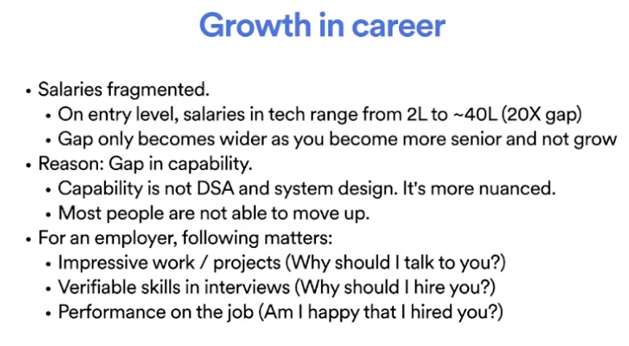
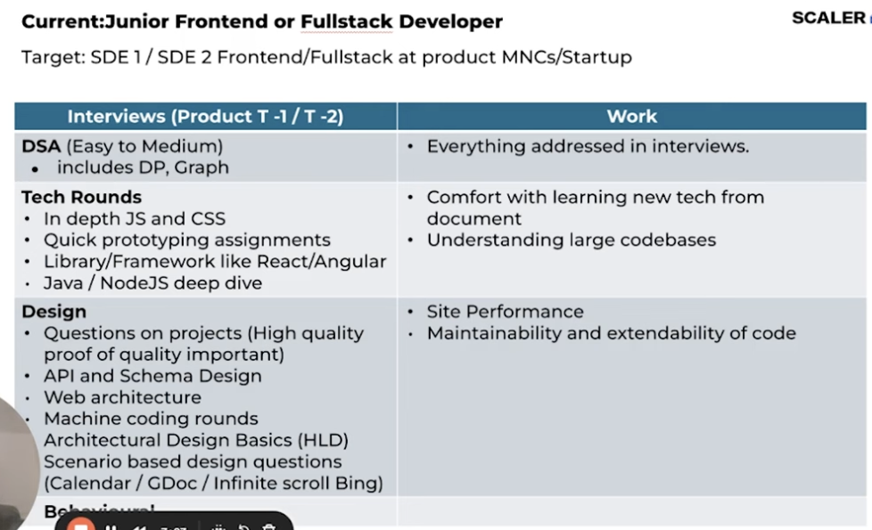
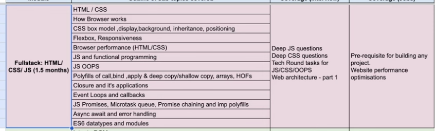
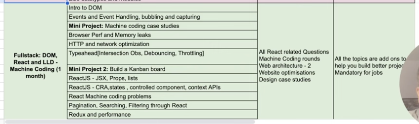
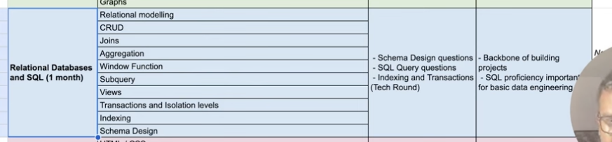
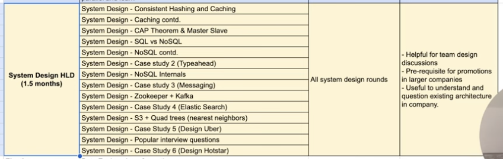

# Growth path
Created Wed May 15, 2024 at 11:23 PM

## Junior frontend/Fullstack
Gap is to much, even for entry level. The way to bridge gap is capability building.

## Where people fail
- Merely calling function and building simple UIs is not enough.
- Stuff like bundle size repaint, minimize, code-splitting, DNS matters. But get perceived as less, especially due to chronic work in low paying companies. High paying companies do care about this.

## Working on the job
- Learn fast: libs, frameworks change fast.
- Communicate and handle ambiguous problems: talking to product people etc.
- Solve non-easy problems: build a collaborative text editor (db schema, UI state, handle collisions), build a spell checker, build linux's `diff` function.

## UI

## Databases

## Capstone project

## System design
