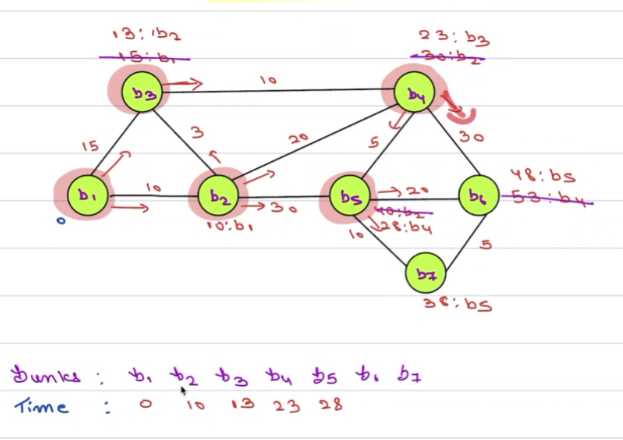

# 3. Problem Solving Mindset
Created Fri May 17, 2024 at 9:27 PM

## Algorithms
A step by step way to solve a task, is called an algorithm.

## Data structure
A container where data is arranged for fast access (whatever requirements), is called a data structure.

## Stack
Real world usage: 
1. Undo/redo operation
2. Back on browser

## Petrol pumps and blasts, with inflammable roads 

This Dijkstra's algorithm.

## Stuff
Q1: Among all the topics of DS and A, what percentage do you/scaler teach in an intuitive way, like Blasts-and-Petrol? Like among the ~30 topics, how many?
A: If a particular lecture has less attendance, then they try to make it intuitive.

Q2: Did you verify that blasts analogy really holds for the algorithm?
A: Yes, but he does do a raw version, and makes clear the differences between blast analogy

Q3: Did you verify that blasts analogy really holds for the algorithm?
A: Yes, but he does do a raw version, and makes clear the differences between blast analogy

Q4: Did you verify that blasts analogy really holds for the algorithm?
A: Collections will be covered in the course.