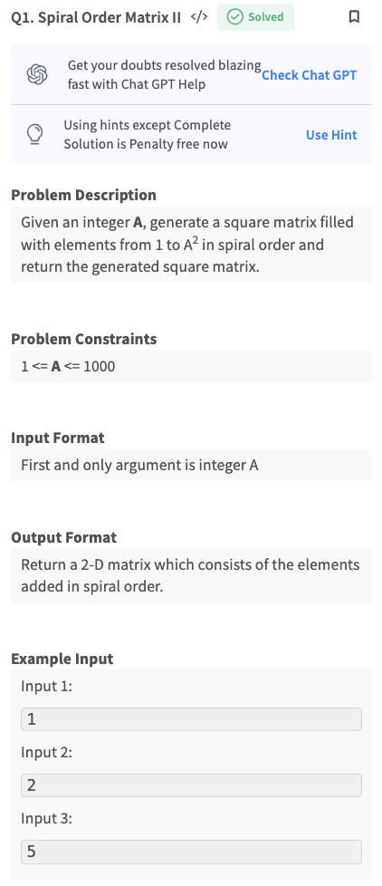
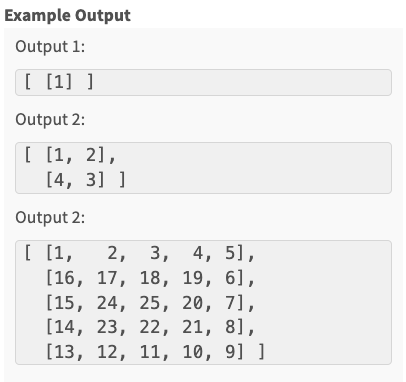
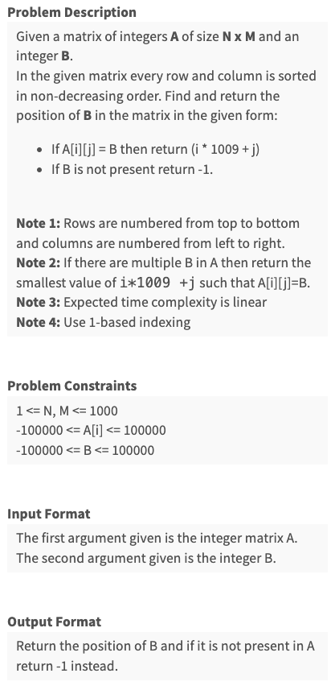
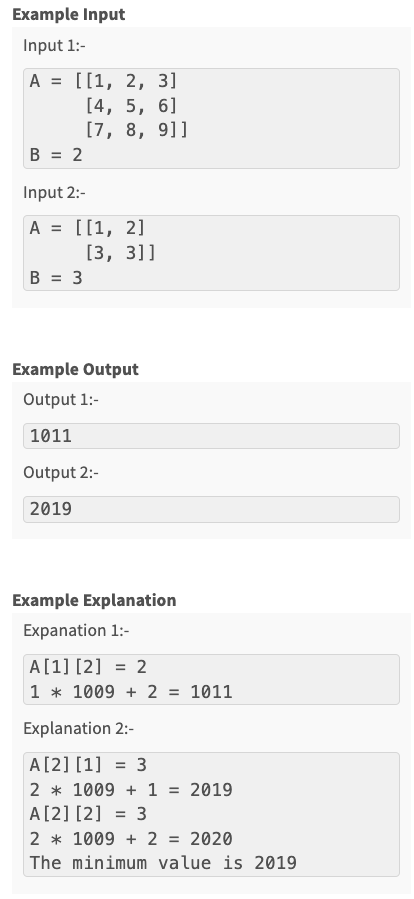
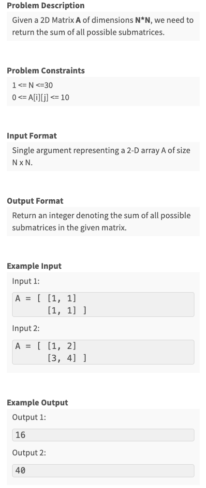
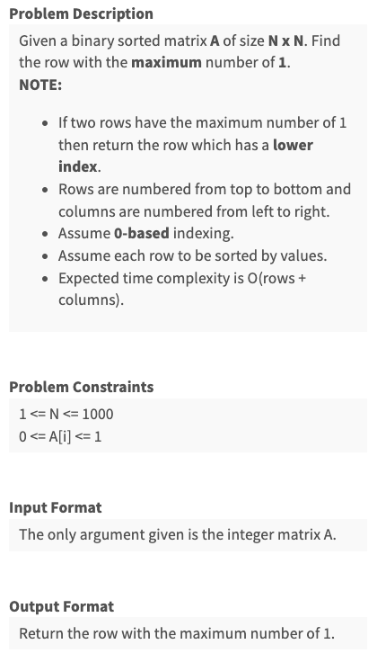
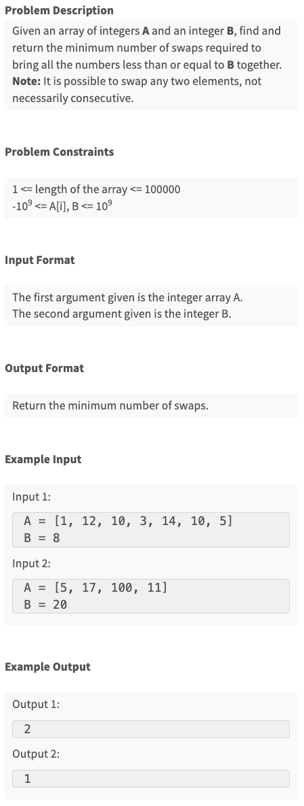

Created Wed May 29, 2024 at 10:30 PM
## Lectures

### Find number in matrix thats sorted both row and column wise
#### Naive approach
Do a range-check-and-binary-search, on either rows or columns.
O(m * log (n)) time, O(1) space

#### Optimal approach
If we could perform a walk in the matrix in a deterministic way, that would not require us to do searches.

Lets start from top-left =>  both right and down are increasing, so ambiguous.
Lets start from top-right => left if find lesser, down is finding greater. ok.
Lets start from bottom-left => left if find lesser, down is finding greater. ok.
Lets start from bottom-right => both right and down are decreasing, so ambiguous.

Lets pick start-from-top-right approach, and verify if we can always make a move. Note that movement depends on current (cell) value, not the values we'll be at (if we make a move). So top-right is unambiguous (as seen above). There are two possible moves:
1. To left: we do this when key is less than current. One extra thing is that it also invalidates all elements below (i.e. in column) current cell, and we never need to consider those.
2. To bottom: we do this when key is greater than current. One extra thing is that this move also invalidates all values to the left (i.e. in row), and we never need to consider them.
   
So, for each iteration, we are able to eliminate either a row or a column, and since movements only depends on current value (and not value-to be, which may be same in both direction, so them being equal is irrelevant). So by induction, we will always be able to make a move.

If we find the element, that's fine, and if we get thrown off the matrix, then return false.

### Binary matrix sorted rows find max row
Same thing, start from top-right, and move to the left until 1s are present. Once we are at the leftmost end of 1s, we move down, but actually, down and left, since we know the current max 1s row already.

We are moving optimally row wise (in a row), obviously.
To prove that we are moving optimally column wise, just observe that there's no need to consider the top rows (since we came from them already), and so the only option is to move down. And also left. If we encounter a 0 when we do down-and-left, we'll just drop down in the next case, instead of drop-and-left.

Reaching the last row will let us know the max 1s row. Can be kept track of using a variable, in addition to maxCount variable.

### Spiral print matrix (clockwise inside to out)
May be square or rect.


- Keep layerIndex variable.
- Keep direction variable.
- 4 for loops. count n - 2 * layerIndex - 1
- ~~stop-check-odd-even~~ (do a total count check simply)

### Boundary print matrix (clockwise inside to out)
A subset of the above problem, or code it directly

### Introduction to submatrix - concept
A rectangle bounded within given matrix is called a submatrix. Smallest possible submatrix is 1x1.

- Representation of submatrix. A simple approach is by using two points (top left and bottom right). Other combinations either have direction ambiguity. Ok.

### Sum of all possible submatrices
#### Naive approach
Traverse all. and sum. so cartesian (size x startPoint\[x, y] x sum) => O(n<sup>4</sup>) time

#### Slightly better
Use window sum, so summing becomes O(1).
so cartesian (size x startPoint\[x, y] x sum_1) => O(n<sup>3</sup>) time

#### Optimal approach (count contribution)
Lets count frequency of terms for given point (i, j). This is exactly the sort of breakdown we did with "sum of all possible subarray".

So, for P(i, j), the whole of 0 to i-1, and j-1 ending submatrices are not relevant.
P(i, j) => consider all variations. And to do reliably we need ti consider the representation of submatrix, i.e. 2 points top-left and bottom-right. lets look at top left from P(i, j)  there are total of i \* j (top left outer square, inclusive). And then lets look to bottom-right-inclusive P(i, j). There are total of (n-i) \* (n-j).

So total variations are: (i\*j) \* ((n-i) \* (n-j))

The only overlap is 1x1 cell P(i, j). This is true, even though the two ranges we considered were inclusive, since both are rectangles. But see carefully, even the 1x1 P(i, j) is not an overlap. See, if we write the multiplication as a sum: (red1 \* greens) + (red2 \* greens) + (bottom-right-red \* greens), all except bottom-right-red are simple and easy. Now, this expression is enough to get variates, and we don't need to write an expression for the greens. Also, expanding on the last term, again, bottom-right-red \* greens = bottom-right-red \* (top-left+green + green2 + green3...), in this bottom-right-red and top-left-green comes only once, so there's no overlap. Nothing to subtract.

Ok, so for each element P(i, j), its contribution is P\[i]\[j] * (i\*j) \* ((n-i) \* (n-j)). This is O(1) op.
To get the whole sum, iterate over all values, O(n<sup>2</sup>).

Perf: O(n<sup>2</sup>) time, O(1) space.

Learning:
- **Represent and combinatorics**: In problem where the goal is to count/sum/some-func all possible variations, the go to approach should be to properly (i.e. uniquely) represent a general variation. Then multiplication and overlap from combinatorics can be used, and since combinatoric formulas are O(1), the solutions will most likely be optimal.


## Assignments
### Q1 - Spiral Order Matrix II 


```js
module.exports = { 
 //param A : integer
 //return a array of array of integers
	generateMatrix : function(A){
		let n = A;
		let layerIndex = 0;
		let lastLayerIndex = Math.floor(n/2);
		let answer = Array(n).fill(null);
		for(let i = 0; i < n; i++) {
			answer[i] = Array(n).fill(0);
		}

		let globalCount = 1;
		while(layerIndex <= lastLayerIndex) {
			let sideCount = n - 2*layerIndex - 1;
			let rowIndex = layerIndex, colIndex = layerIndex;

			// TL to TR
			for(let count = 0; count < sideCount; count++) {
				answer[rowIndex][colIndex] = globalCount++;
				colIndex++;
			}

			// // odd numbered
			// if(lastLayerIndex % 2 && rowIndex === lastLayerIndex && colIndex === lastLayerIndex) 
			// {
			// 	break;
			// }


			// TR to BR
			for(let count = 0; count < sideCount; count++) {
				answer[rowIndex][colIndex] = globalCount++;
				rowIndex++;
			}

			// BR to BL
			for(let count = 0; count < sideCount; count++) {
				answer[rowIndex][colIndex] = globalCount++;
				colIndex--;
			}

			// BL to TL
			for(let count = 0; count < sideCount; count++) {
				answer[rowIndex][colIndex] = globalCount++;
				rowIndex--;
			}

			// even numbered
			// if(lastLayerIndex % 2 === 0 && rowIndex === n - layerIndex && colIndex === layerIndex) 
			// {
			// 	break;
			// }

			layerIndex++;
		}
		
		if(n % 2) {
			answer[lastLayerIndex][lastLayerIndex]=globalCount++;
		}

		return answer;
	}

};

// 1  2  3  4
// 12 13 14 5
// 11 16 15 6
// 10 9  8  7

// 1  2  3
// 8  0  4
// 7  6  5
```

### Q2 - Search in a row wise and column wise sorted matrix


```js
module.exports = { 
 //param A : array of array of integers
 //param B : integer
 //return an integer
	solve : function(A, B){
        // do range+binary search on each row/column. This would be m * log(n), so not linear.
        // lets start from an extreme point, and try to walk the grid
        // 5 possibilities => TL, TR, BL, BR, mid-point
            // - TL => if key > currentVal, then there are two potential directions
            // - TR => if key > currentVal, just one dir. If <, then also one dir.
            // - BR => if key > currentVal, then there are two potential directions
            // - BL => if key > currentVal, just one dir. If <, then also one dir.
            // mid point -> if key > currentVal, two dirs.
        // Lets choose the unambiguos points. TL.
        // Lets verify if they take us to the value if is present or not (i.e. they can reach the goal point, be it anywhere)
            // TL, if >, we move down. if <, we move left. So move is easy to make.
            // in ths next point, the same can be done, and so on.
        // lets check if it takes us towards the correct point
            // if >, we move down (anyway the current rows left is all irrelevant). So on each down movement, we're sure the current row will not be relevant.
                // this means we won't have to move up once we move down, since the upper values are for sure irrelevant
            // if <, we move left (this makes current column below elements irrelevant)

        // Hence the things we leave behind are always irrelevant. So fine.
        
        // time complexity, maximum walks is along full width and full height => O(m + n)
        // space complexity, O(1)

        let key = B; // rename symbol
        let numRows = A.length;
        let numCols = A[0].length;
        let i = 0, j = numCols - 1;

        // iteration condition is bound check
        let foundI = -1;
        let foundJ = -1;
        const DEBUG = [];
        while(i < numRows && j >= 0) {
            DEBUG.push([i, j]);
            if(A[i][j] > key)
                j--;
            else if(A[i][j] < key)
                i++;
            else
             {
                // smallest value of i * 1009 + j
                // Moving down. Stop, since encounter first is good (min ans);
                // But if on the same row, we should keep going left
                if(foundI === -1)
                {
                    foundI = i;
                    foundJ = j;
                    j--;
                }
                else if(foundI === i && j < foundJ) {
                    foundJ = j;
                    j--; // move left
                }
                else 
                    break; // reached point
             }
        }

        if(foundI === -1) return -1;
        return (foundI+1) * 1009 + (foundJ+1); // "1 based indexing"
	}
};
```

### Q3 - Sum of all Submatrices

```js
module.exports = { 
 //param A : array of array of integers
 //return an integer
	solve : function(A){
        // combinations, so need to represent.
        // matrix can be represented by TL and BR points
        // count frequency of P(i, j), then sum it

        // top-left of P(i, j) inclusive contain P(i, j)
        // bottom-right of P(i, j) inclusive contain P(i, j)
        /**
         * 1 1 1 x x
         * 1 1 1 x x
         * 1 1 i 2 2
         * x x 2 2 2
         */
        // total combinations for P(i,j) = (i + 1) * (j + 1) * (m-i) * (n-j)
        // what about the overlap => consider submatrices from 1s side, 1 * i + 1 * 2 ... + 1..2, this covers all combos, and is eq to expression above
        // overlap of i itself 1x1, well 1 * i is coming just once. There's no expression from 2's end.
        // so overlap = 0

        const m = A[0].length;
        const n = A.length;


        let answer = 0;

        for(let i = 0; i < m; i++) {
            for(let j = 0; j < n; j++)
            {   
                const element = A[j][i];
                const frequency = (i + 1) * (j + 1) * (m-i) * (n-j);

                answer += (element * frequency);
            }
        }

        return answer;
	}
};
```

### Q4 - Row with maximum number of ones


```js
module.exports = { 
 //param A : array of array of integers
 //return an integer
	solve : function(A){
        // Approach 1, count rows, and find max => have to consider all cells => O(n^2), O(1)
        // Approach 2, do binary search of 1 => have to consider all rows => O(nlgn), O(1)
        /* Approach 3, try to do a walk. We have 4 starting points TL, TR, BR, BL
            - TL isn't helpful since if it's zero, we don't know if to go right (to find 1), or below (if its 1)
            - TR if it's 0, our only move is down (find 1 directly below). Other moves: left (will be 0), right (we already started from right), up(we already are at top)
              if it's 1, we move left-down.
                But will this work after the TR point. Lets see.
                If TR is 0, we move down (knowing for sure that the current row is irrelevant)
                If TR is 1, we know atleast 1 would be the answer, and 
                    moving down if 1 would not update answer, if 0, would not be helpful (since answer would not update since length is even less)
                    moving left would be helpful, it would either be 1, (update our answer for max size), or be 0, do nothing, well keep moving down like usual
                    // so always move left after encountering 1
            this approach always terminates, and ignores irrelevant regions only
            QED works
        */
        let maxSize = 0;
        let maxSizeRowIndex = -1;
        let numRows = A.length;
        let numCols = A[0].length;

        let i = 0, j = numCols - 1;

        // Iter condition is bound check. move down, and left. i -> Infinity, j -> 0
        while(i < numRows && j >=0) {
            if(A[i][j] === 1) {
                maxSizeRowIndex = i;
                // maxSize++;
                j-=1; // move bottom-left
            } else {
                i++; // move down
            }
        }

        return maxSizeRowIndex;
	}
};
```

## Additional assignments
### Q1 - Minimum Swaps (Easy)

```js
module.exports = { 
 //param A : array of integers
 //param B : integer
 //return an integer
    solve : function(A, B){
        // terms: desirable elements (element <= B)
        // dCount = number of desirable elements
        // now, when all are together, that'll be a subarray (somewhere)
        // We have to figure out minimum swaps
        // Instead of trying to think of a CFE like thing
        // just consider the variate (subarray locations). At each location, calculate undesirable elements, i.e. have to be bought in, i.e. swapsNeeded
            // do so for all possible subarrays and maintain min swapsNeeded
            // actually can do even rolling check
        
        // O(n) solution

        const dCount = A.reduce((accum, item) => accum + (item <= B ? 1 : 0), 0);
        let minSwapsNeeded = A.reduce((accum, item, index) => accum + (index < dCount && item > B ? 1 : 0), 0);

        for(let i = dCount; i < A.length; i++) {
            const releaseElement = A[i - dCount];
            const currentSwaps = minSwapsNeeded + (releaseElement > B ? -1 : 0) + (A[i] > B ? 1 : 0);
            if(currentSwaps < minSwapsNeeded)
                minSwapsNeeded = currentSwaps;
        }

        return minSwapsNeeded;
    }
};
```

Other approaches (not good)
```js
module.exports = { 
 //param A : array of integers
 //param B : integer
 //return an integer
    solve_2 : function(A, B){
        // REMARK: trying to derive CFE almost, no need.
        // count the number of elements <= B, say its w.
        // then try the window of size w, with highest number of elements <= B
            // such a window will have some unfavorable, elements, which we'll swap.
            // that's it
        // what if w = N, well ignore such elements and still find the window
        // in the end we'll choose what to move, either leftElements, rightElements or the window ones

        const smallerParitionSize = A.reduce((accum, item) => accum + (item <= B ? 1:0), 0); // n - countOfGT
        let n = A.length;
        let maxSize = A.reduce((accum, item, index) => accum + (index < smallerParitionSize && item <= B ? 1:0), 0), maxSizeEndIndex = smallerParitionSize - 1;
        let j = smallerParitionSize;
        let currentWindowSum = maxSize;
        while(j < n) {
            currentWindowSum -= (A[j-smallerParitionSize] <= B ? 1: 0);

            if(A[j] <= B) {
                currentWindowSum+=1;
            }
            
            if(currentWindowSum > maxSize) {
                maxSize = currentWindowSum;
                maxSizeEndIndex = j;
            }

            j++;
        }

        return JSON.stringify({smallerParitionSize, maxSize});
    },
	solve_1 : function(A, B){
        // REMARK: too many subroutines, not desirable.
        // count min number of swaps
        // to bring elements less than B together

        // use two pointers, starting at extremes, coming towards the center
        // if left element (at index) 
            // < B, keep moving right
            // >= B (swipe with something on the right. which right?)
        // if right element (at index) 
            // >= B, keep moving left
            // < B (swipe with something on the left. which left?)

        // Problems with above, if array is mostly reverse sorted. There will be too many swaps (right to left) without any reason
        // maybe do a initial pass to check nature of array
            // we basically find the parition index if B were to be inserted. Then we check the left portion and right portion
            // if most elements are already on the one side, and if that side is ~sorted, we follow the algo.
                // what does this mean exactly? see at the end, the window-of-smaller elements will be present, and it will all be on one side compared to the partition
                    // so the partition is a relevant point, length wise., to check nature, the favorable parition will have > n/2 small numbers
            // else we reverse the array and then apply our algorithm

        //// Implement
        // 1. Find parition index w.r.t B
        // 2. Find left parition count of numbers less than B
        // 3. 1 and 2 can be done in single pass
        // 4. reverse the array if needed
        // 5. Start iterating the favorable side, and count numbers >= B, that's the number of swaps (to where does not matter actually)

        const smallerParitionSize = A.reduce((accum, item) => accum + (item <= B ? 1:0), 0); // n - countOfGT
        const paritionIndex = smallerParitionSize;
        let leftParitionLTCount = 0;
        let rightParitionLTCount = 0;
        for(let i = 0; i < A.length; i++) {
            if(A[i] <= B) {
                if(i < paritionIndex)
                    leftParitionLTCount++;
                else
                    rightParitionLTCount++;
            };
        }

        if (leftParitionLTCount >= rightParitionLTCount)
            return smallerParitionSize - leftParitionLTCount;
        else
            return smallerParitionSize - rightParitionLTCount;
	}
};
```
