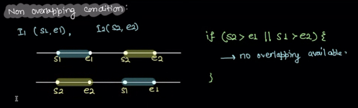
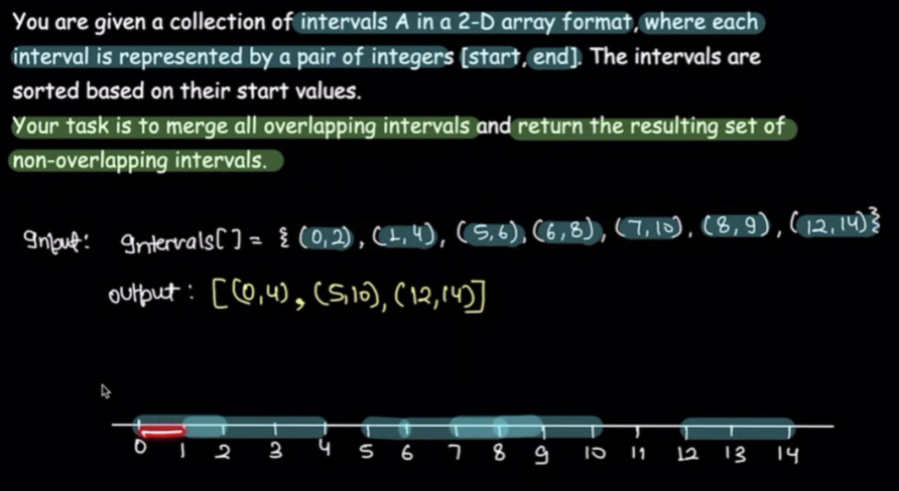
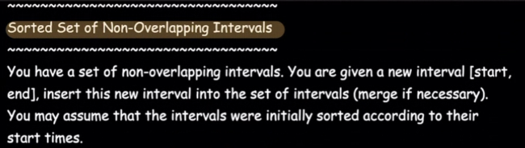
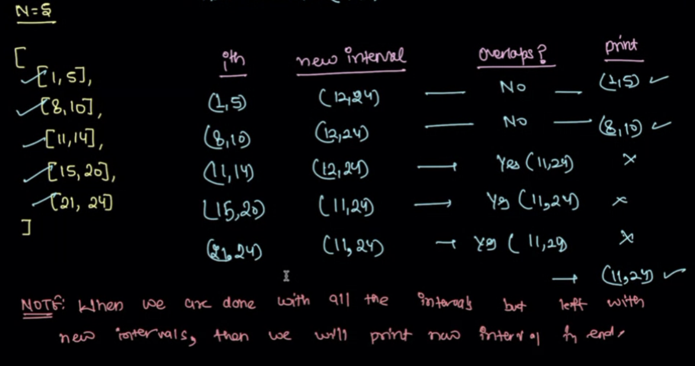
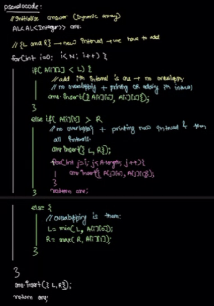
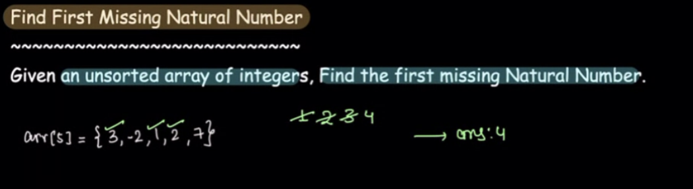

# 5. Arrays 3
Created Fri May 31, 2024 at 9:29 PM

## Lecture
### Intervals, overlapping, non-overlapping
- An interval is a 2-size array \[a, b] where a, b are numbers and a <= b.
- Overlapping intervals are two intervals such that some values are common in both. CFE?
	- Non-overlapping if they have nothing is common. CFE?
	  
	- Multiple intervals can also be said to overlapping or non-overlapping. CFE?

### Find non-overlapping intervals after merge

#### Naive and optimal answer :)
We have to merge anyway, and they are sorted.
Maintain a single variable `mergedInterval`, set it initially to first interval.
Iterate over the intervals and try to merge the `mergedInterval` with interval at hand. 
- If they merge (`currentInterval.start <= mergeInterval.end`), update `mergedInterval` (start will remain same, only end will change).
- If they don't merge, then print the `mergedInterval`, and set (reset) it to interval at hand.
- Continue.
- Would need to check if last one is non-overlapping.

We would have printed all merged overlapping intervals.

O(n), O(1)

Note:
- There's no max, min, so any single pass Kadane based approach is not needed.
- Fact here was: *Just try*
- If intervals weren't sorted. We just sort them (need a custom comparator since it's a pair), and then apply this method.

### Least disruptive maintenance slot
Time is 24 hours format. Work shouldn't be done in a shift involving 12am night (avoid circle).

#### Simple answer
The solution needs a subroutine. The subroutine is that we calculate merged overlapping intervals (the above problem). Finally we iterate and find out longest slot. This can also be done in one pass.

### Sorted set of Non-overlapping intervals

The insertion should be such that final intervals also holds the property that they're "sorted and non-overlapping".

#### Simple answer
Traverse over intervals, and check if input interval is overlapping with current interval or not:

0. Initialize start = `input.start <= intervals<=[0] ? input.start :-1`, end = -1.
1. If no, print, move on.
2. If yes, print the start value of current interval.
3. Then keep moving:
	1. if it overlaps, do nothing.
	2. If it does not overlap, print the "end" as input interval's end.
		continue. break;
4. Print the rest, if have printed overlapping already.

Can be written as a single loop, and print will be conditional based on if startValue is empty (-1 or not).

O(n) time, O(1) space

Example:

Pseudocode:

### Find first missing natural number
 
#### Naive answer
 Sort, and traverse to find out. 
 O(nlgn) time, O(1) space
#### Little better
 Keep aux array of size n, all valued to false (seen).
 Traverse all input values, if it's a natural number, set the array value to true.
 Traverse over the aux array, and print the (index+1) for that's false.

#### Optimal
Same as above, except we can override the input array to instead of maxing explicit aux array.

O(n) time, O(1) space

Note:
- If need memory, always check if input may be overridden in a safe way. If yes, we get that space for free. Makes O(n) O(1) and algorithm (as if taking aux array) remains same (except some safety override proofs).

## End of arrays
We're done with arrays