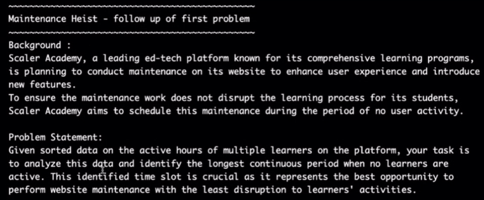
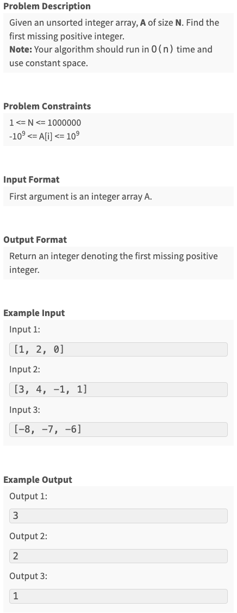
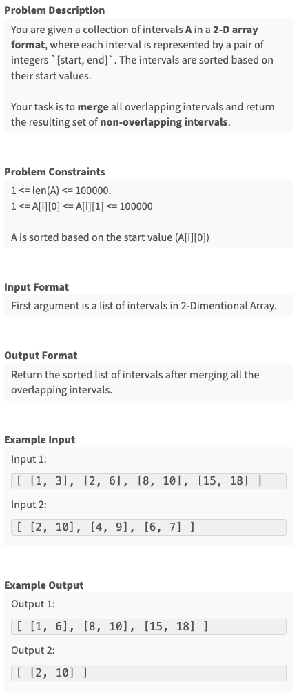
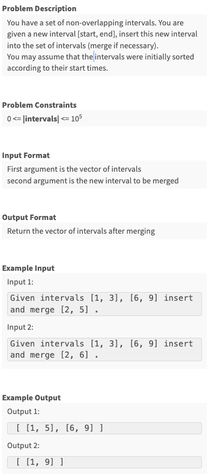
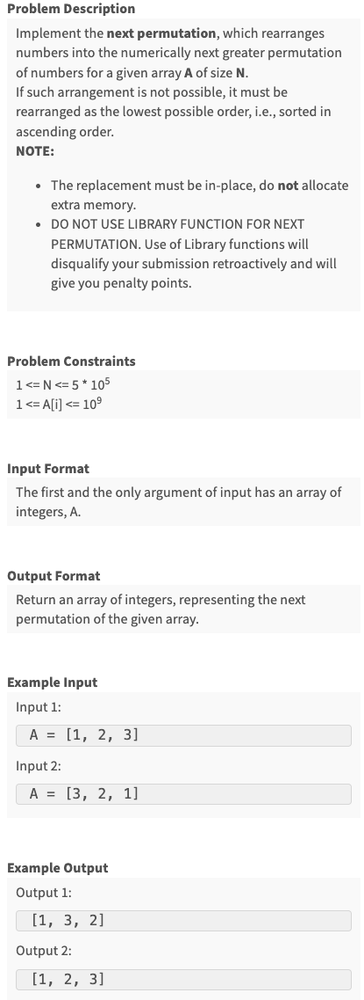
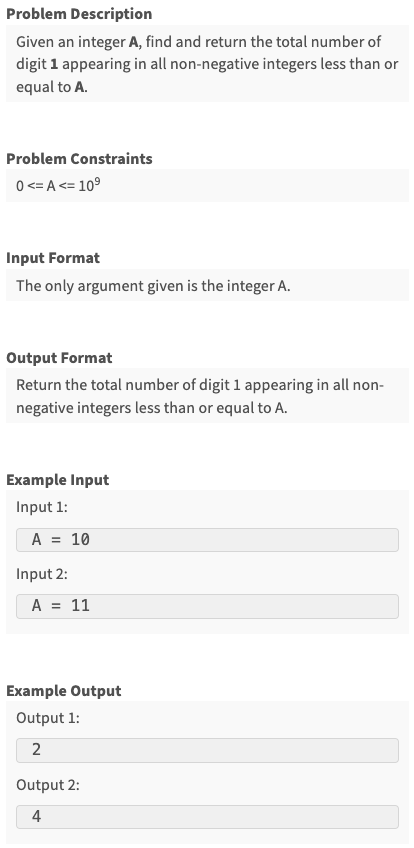

# 5. Arrays 3
Created Fri May 31, 2024 at 9:29 PM

## Lecture
### Intervals, overlapping, non-overlapping
- An interval is a 2-size array \[a, b] where a, b are numbers and a <= b.
- Overlapping intervals are two intervals such that some values are common in both. CFE?
	- Non-overlapping if they have nothing is common. CFE?
	  
	- Multiple intervals can also be said to overlapping or non-overlapping. CFE?

### Find non-overlapping intervals after merge


#### Naive and optimal answer :)
We have to merge anyway, and they are sorted.
Maintain a single variable `mergedInterval`, set it initially to first interval.
Iterate over the intervals and try to merge the `mergedInterval` with interval at hand. 
- If they merge (`currentInterval.start <= mergeInterval.end`), update `mergedInterval` (start will remain same, only end will change).
- If they don't merge, then print the `mergedInterval`, and set (reset) it to interval at hand.
- Continue.
- Would need to check if last one is non-overlapping.

We would have printed all merged overlapping intervals.

O(n), O(1)

Note:
- There's no max, min, so any single pass Kadane based approach is not needed.
- Fact here was: *Just try*
- If intervals weren't sorted. We just sort them (need a custom comparator since it's a pair), and then apply this method.

### Least disruptive maintenance slot
Time is 24 hours format. Work shouldn't be done in a shift involving 12am night (avoid circle).


#### Simple answer
The solution needs a subroutine. The subroutine is that we calculate merged overlapping intervals (the above problem). Finally we iterate and find out longest slot. This can also be done in one pass.

### Sorted set of Non-overlapping intervals

The insertion should be such that final intervals also holds the property that they're "sorted and non-overlapping".

#### Simple answer
Traverse over intervals, and check if input interval is overlapping with current interval or not:

0. Initialize start = `input.start <= intervals<=[0] ? input.start :-1`, end = -1.
1. If no, print, move on.
2. If yes, print the start value of current interval.
3. Then keep moving:
	1. if it overlaps, do nothing.
	2. If it does not overlap, print the "end" as input interval's end.
		continue. break;
4. Print the rest, if have printed overlapping already.

Can be written as a single loop, and print will be conditional based on if startValue is empty (-1 or not).

O(n) time, O(1) space

Example:


Pseudocode:


### Find first missing natural number
 
#### Naive answer
 Sort, and traverse to find out. 
 O(nlgn) time, O(1) space
#### Little better
 Keep aux array of size n, all valued to false (seen).
 Traverse all input values, if it's a natural number, set the array value to true.
 Traverse over the aux array, and print the (index+1) for that's false.

#### Optimal
Same as above, except we can overwrite the input array to instead of maxing explicit aux array.

O(n) time, O(1) space

Note:
- If need memory, always check if input array may be overwritten in a safe way. If yes, we get that space for free. Makes O(n) space -> O(1), and algorithm (as if taking aux array) remains same (except some safe overwrite proofs).

## Assignments
### Q1 - First Missing Integer ✅

```js
module.exports = { 
 //param A : array of integers
 //return an integer
	firstMissingPositive : function(A){
        // A. Move all positives to the left

        // positives on left
        let writePosition = 0;

        const n = A.length;
        for(let i = 0; i < n; i++) {
            if(A[i] <= 0) continue; // ignore, write head unaffected

            // if write head and current position are same, we are good (also writePosition < i in case of negatives on the left)
            // move to write head to proper position
            while(writePosition < i && writePosition < n && A[writePosition] > 0) writePosition++;

            // written to start, move
            A[writePosition] = A[i];
            writePosition++;
        }
        const m = writePosition; // size of positive size array

        // B. Mark presence with negatives
        for(let i = 0; i < m; i++) {
            const magnitudeOfValue = Math.abs(A[i]);
            const indexFromValue = magnitudeOfValue - 1;

            if(indexFromValue >= m) continue; // ignore out of bound

            // mark presence (idempotent)
            A[indexFromValue] = A[indexFromValue] < 0 ? A[indexFromValue] : -A[indexFromValue];
        }

        // C. traverse return unvisited value
        for(let i = 0; i < m; i++) {
            const isPresent = Math.sign(A[i]) === -1;
            if(isPresent) continue;
            
            const valueFromIndex = i + 1;
            return valueFromIndex;
        }

        // if reach here, means 1 to m were present
        return m+1;
	}
};
```

### Q2 - Merge Sorted Overlapping Intervals ✅

```js
function mergeIntervals(intervals) {
  if (intervals.length === 0) return [new_interval];

  const answer = [];
  let movingInterval = [intervals[0][0], intervals[0][1]];

  for (let i = 0; i < intervals.length; i++) {
    const currentInterval = intervals[i];
    const isOverlapping = currentInterval[0] <= movingInterval[1];

    if (isOverlapping) {
      movingInterval[1] = Math.max(movingInterval[1], currentInterval[1]); // subsume or extend
      if (i === intervals.length - 1) {
        answer.push(movingInterval);
      }
    } else {
      answer.push(movingInterval); // we done with moving one
      movingInterval = currentInterval; // reset to current
      if (i === intervals.length - 1) {
        answer.push(currentInterval); // if last push that
      }
    }
  }

  // at every iter start, we have movingInterval as a correct value
  // this is good, but not enough, i.e. near the last
  // case 1: p and q are overlapping, in that case, we get the final interval as p-merge-q, saved in movingInterval but not pushed to array.
  // case 2: p and q are not overlapping, in that case, we have q left. movingInterval === q is a fact here.
  // lets add these as if conditions so we don't have to figure out different fact.

  return answer;
}

module.exports = { 
 //param A : array of array of integers
 //return a array of array of integers
	solve : mergeIntervals
};
```
### Q3 - Insert interval in sorted intervals 🟠


## Advanced assignments
### Q4 - Next Permutation

```js
module.exports = { 
 //param A : array of integers
 //return a array of integers
	nextPermutation : function(A){

	}
};
```
### Q5 - Number of Digit One

```js
module.exports = { 
 //param A : integer
 //return an integer
	solve : function(A){

	}
};
```
## End of arrays
We're done with arrays