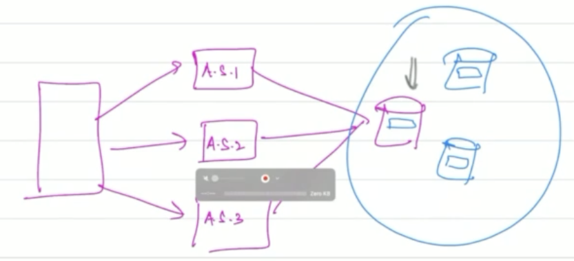
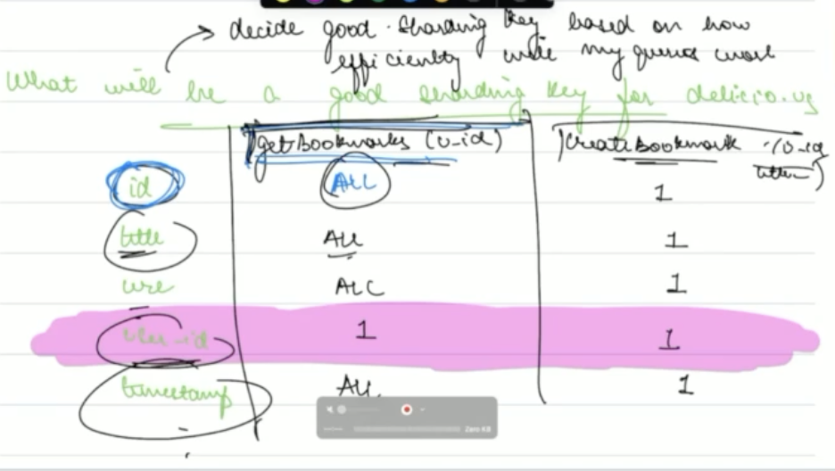

https://www.scaler.com/academy/mentee-dashboard/class/211470

## Lecture
In the previous lecture, We were talking about the bookmarking website called deli.cio.us. 
- We solved the problem of receiving incoming internet requests, by getting a public IP address from our ISP, and getting a domain name from a registrar.
- We solved the problem of maintenance update, where the site will be complete unavailable for a short time. We solved this (SPOF) issue by having multiple app servers with a LB. Having high load is also a problem, that's also solved via LB.

Lets resume from the last lecture.

Lets estimate the size of the data that "deli.cio.us". For this we'll do a rough calculation. So lets make a rough DB schema. Suppose the data was stored in a single table. There are 4 columns:

Each row is 100 bytes. We estimate row creation per user/ per day to be 0.25, and estimated users are 50 million. So total data per day: 1.25 GB. So for 5 years, it'd be 2TB. Now, this is 2003, and max hard disk sizes are 40 GB. So we need to add 1 hard-disk per month. *The important thing to realize here is that keeping all data on a single machine is not possible (assume max horizontal scaling has already been reached). We need multiple machines (i.e. a database cluster)*. So, we choose to have many machines each acting primarily as a database server. Our system looks like this now:

But we have new problem now, when a insertion request is received by an app server, what DB server should be chosen for storing this new data.
## Sharding
The fact is, that our database (as a whole) is now *sharded*. So we need some sharding criteria (aka sharding key).

One criteria for a sharding key is how efficiently all queries on average will be. Lets consider the columns of the table.

It looks like user_id would be a good sharing key, so lets choose that.

Note
- Implementation: This sharding criteria code will be stored and run in app servers. In the worst case scenario, each app server will maintain a connection to all db servers. But if this is too much (db connection pool maxes out), then we can add a second LB between app servers and db servers, in this case the sharing criteria code will be stored on this second LB, and number of connections required is equal to number of db servers. But this second scenario can affect negatively affect the latency of responses.
- The app and db servers are not paired among here, they are independent. We can different number of each too, no problem.
- having a complex sharding criteria, like two columns - say user_id AND title (CHECK, in general or just here), is a terrible idea. The reason is that even if user_id is same, but title is different, the chosen database will be different for two given insertion queries.

Ok, so we have decided a sharding criteria. But still, what db server would an app server choose?

### Consistent hashing
The current problem is: given a value of shard, what database should be chosen?

Properties of an ideal shardKey-dbId solution:
1. Run fast
2. Uniform load distribution
3. Addition/removal of shard should be fast

Now, lets figure out the solution in this scenario.

## Assignment
