# Meet and Greet
Created Wed May 15, 2024 at 9:13 PM

## Software is eating the world
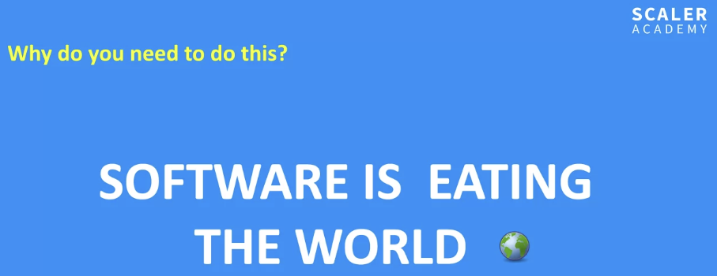

SWE and AI is going to be significant. 
Many things will be streamlined and automated, even stuff like farming.

## Philosophy @Scaler
1. Hard work (high magnitude). They will not discuss dishonest ways of reaching a place. e.g. Sehwag couldn't play all sorts of shots, even though he knew them. So he changes his training method, and started practicing a single shot per day (doing that all day). Eventually he developed muscle memory for many shorts, and it was astounding, so much so that people started thinking he plays casually (instead he was amazingly comfortable, so explicit thinking and gait decreased). *Responsibility of me.*
2. Smart-work (direction). *Responsibility of Scalar, meaning our growth is maximized*. Scaler wants us to trust the path
3. Consistency. *Done by us*. Small and permanent efforts consistently, compound to become large. This is important because long hiatus has large recollection costs associated with it. *Responsibility of me.*

## Pillar 1: Personalised videos depending on your background
> 
Junior Backend: https://www.youtube.com/watch?v=tzGGRXjFT-M
Senior Backend: https://www.youtube.com/watch?v=kdPqhCHsSxE&t=0s
Junior Frontend/Fullstack: https://www.youtube.com/watch?v=94FvopjdMO0&t=0s
Fresher/Non-Tech: https://www.youtube.com/watch?v=AnzqvN638ig&t=0s
QA / SDET / Devops / Network engineer / Salesforce eng: https://www.youtube.com/watch?v=yfV1J6PWZIE&t=0s
Data Engineers: https://www.youtube.com/watch?v=FkZhVZGsH6U&t=0s
Engineering Management (EM, Senior EM, Director): https://www.youtube.com/watch?v=pL0IhLYGgMA&t=0s

### Batch levels
- Beginner - cannot code at all. Or cannot code "print primes between 1 and 100".
- Intermediate - knows programming, but not that familiar with DSA. Or cannot code "not comfy with recursion".
- Advanced - knows DSA not completely comfortable with "all of DSA" like graphs etc. Or cannot code "".

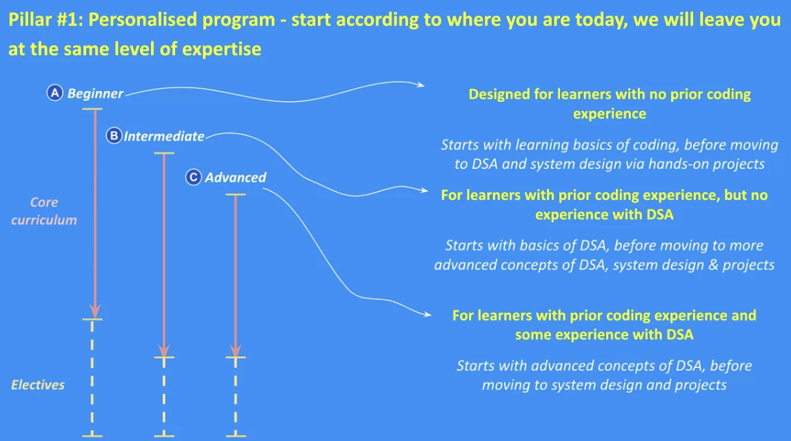

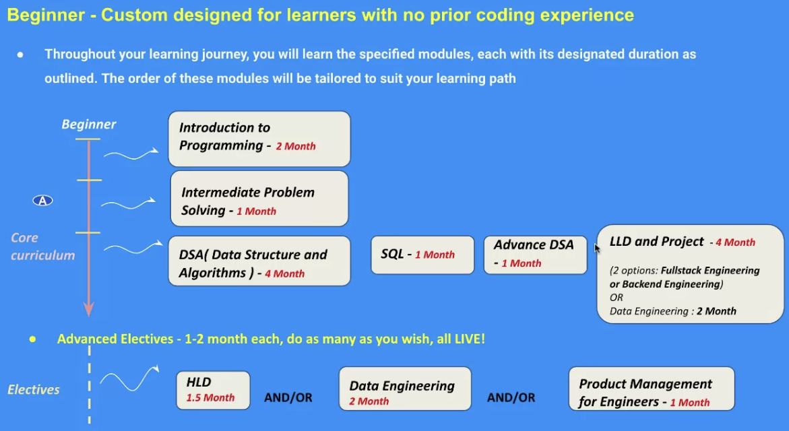

Intermediate = Beginner's stuff - programming lang
HLD becomes part of core curriculum.
Only thing that's language dependent is Project and LLD (concept is agnostic, but implementation).
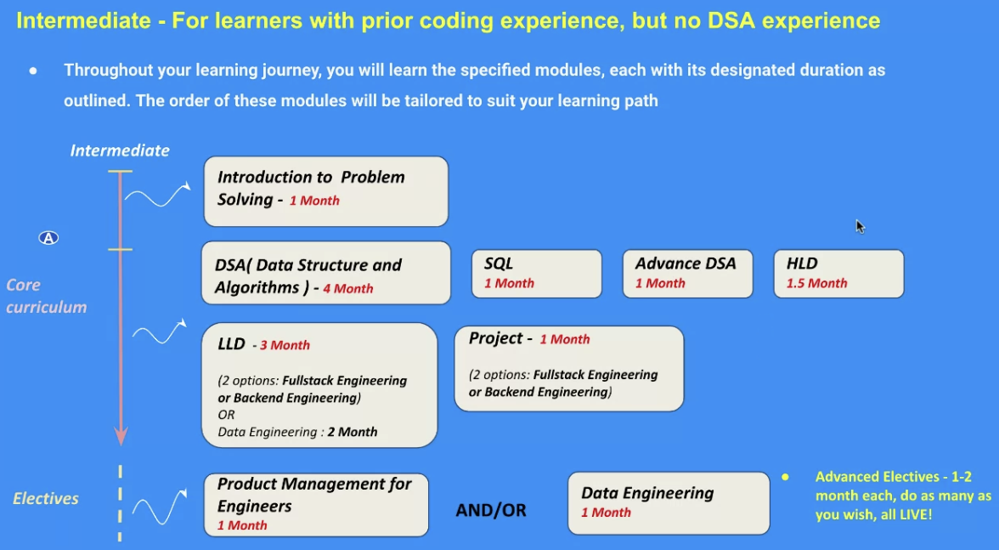

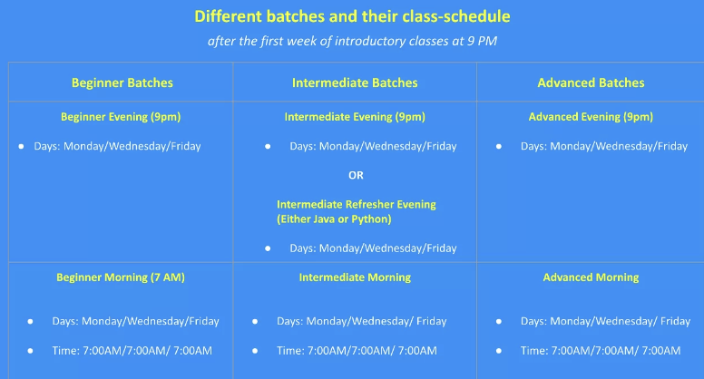

## Pillar 2: Live teaching
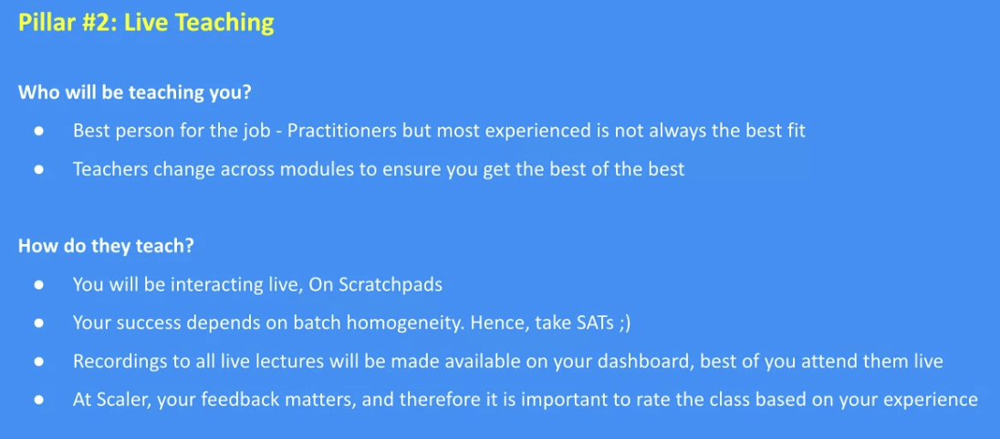

## Pillar 3: Learn by doing with TAs
1. Core Skills curriculum and classes: syllabus like DSA, system-design
2. Career curriculum: making resume, behavioral interview info

## Pillar 4

## Pillar 5
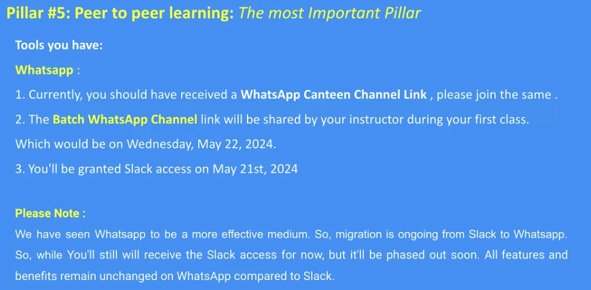

## Scaler clubs
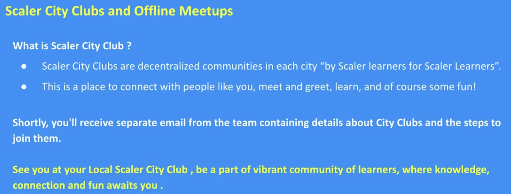

## Pillar 6: Career support
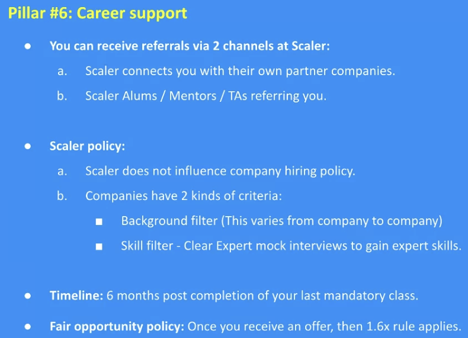
Points that maximize "Scaler as a talent pool" perception:
1. Interview to offer ratio. time and resources. Good talent.
2. Offer to joining ratio: if low, means students aren't interested.
3. Performance on the job. Scaler has negative incentive to teach "game an interview", instead it will focus on actual skill development
4. You effectively get just one offer, and all jobs below 1.6x (accepted) get disabled. Don't "job shop" on Scaler. So Scaler does care about this not happening. So once an offer is accepted (completely on choice) by me, we get deprioritized (by scalar) for other similar jobs. We get priority only for remaining jobs if their value is 1.6x the accepted one. So exception breaking is 1.6n. *Free to offer shop outside*.

Companies have two criteria:
1. Skill based
2. Experience based.

For me, before interviewing a company:
1. Try to finish relevant values to avoid trivial failure.
2. Do mock interviews. "Its better to fail internally then fail in reality, blocking real chances".

Q: CTC 1.6x vs in-hand 1.6x?

## Attrition rate
100 -> 1 month (70%) -> after course 90% placement
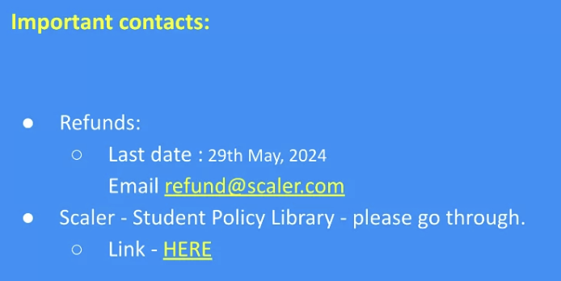

## Classes start
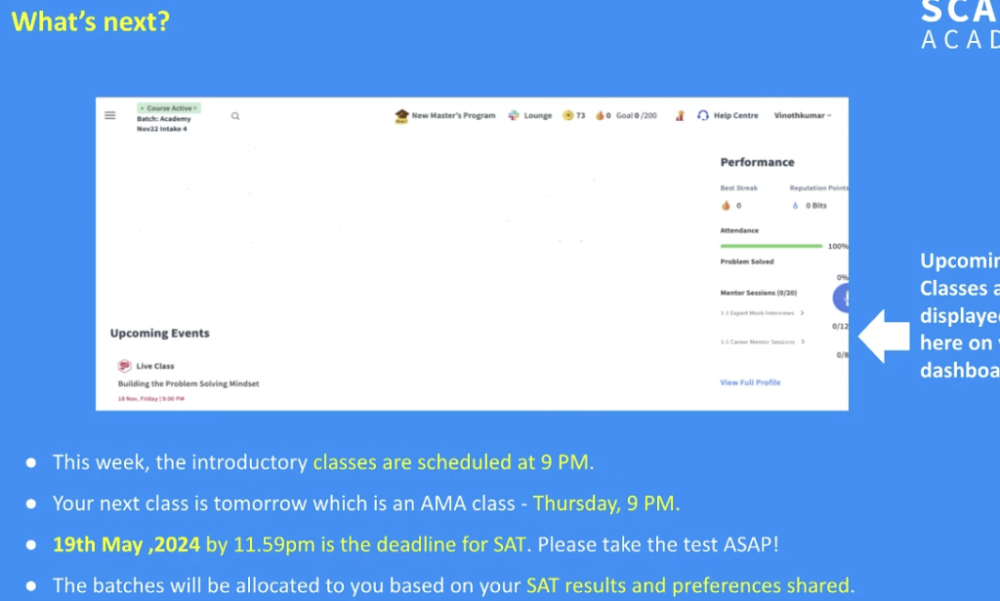

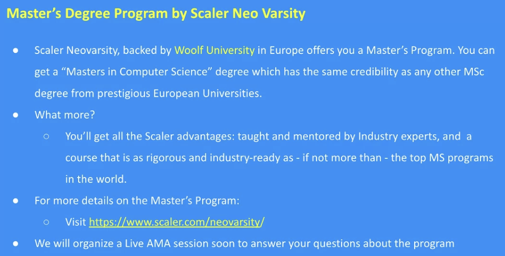

## Can do hackathon
After project

Q: in intermediate batch, will advance java topics will be covered like streams collections multithreading?
A: covered in all batches. Anything thats used in day to day (includes multithreading) will be taught.

Q: sir, os fundamental and computer organization and architecture overview course is there?
A: yes, but very niche topics like instruction-set or cache-layers will probably not be taught.

Q: How many projects will we make in this course? Fullstack/Backend
A: 3 short projects or 2 long projects.

Q: I'm looking for opportunities out side India, is this program helpful?
A: program is helpful for the skill part, but providing outside referral is not a target of Scalar.

Q: Can we target Tech Giant's after scaler journey?
A: historically yes. But there's no guarantee. Advice: look at your journey as a step by step method, instead of reaching the top (only). As long as you have skills that help build stuff in the 10 years in the future, then you're good.

Q: micro services and CI/CD pipelines covered?
A: Microservices yes. CI/CD no.

Q: can we move to data science track in between this track?
A: No, its very different. Just refund and enroll in that track.

Q: How many months we have an access to scaler board and placement assistance after course
A: uptill 6 months. Fact wise, have not removed any recordings for any batches past 5 years. But TA gets removed.

Q: Is Cloud Computing like AWS, Azure covered in the project or course part?
A: Specifically no, but we'll learn enough to project. For expertise, join the DevOps track.

Q: Concepts specific language questions etc
A: TA are trained to solved assignment stuff, and may not be able to answer out-of-assignment. Use the cohort group for that (post the question).