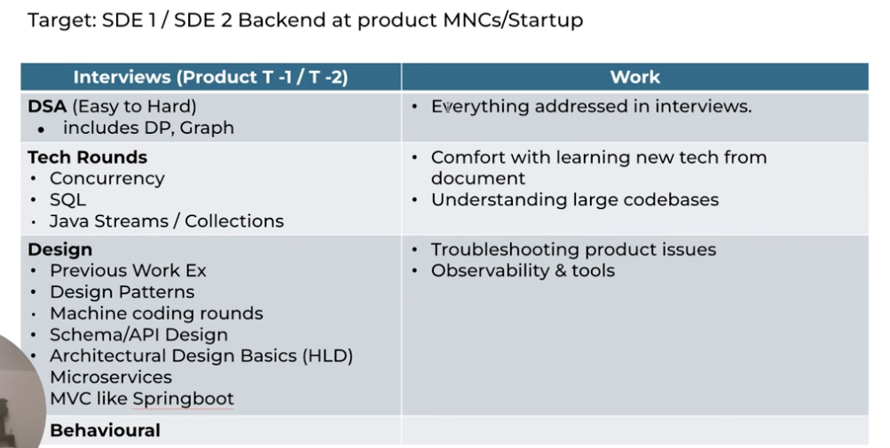
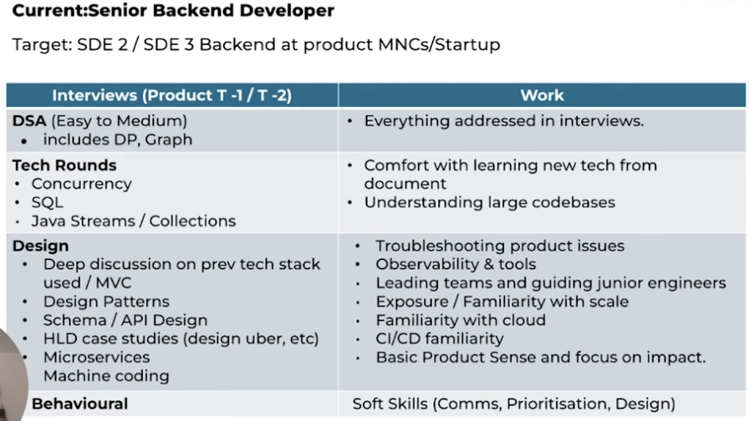
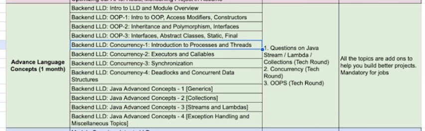
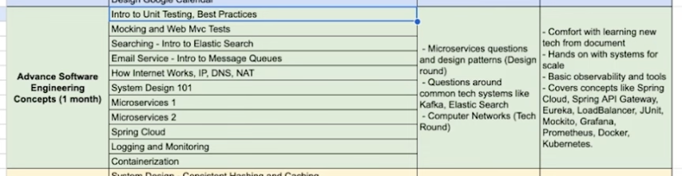
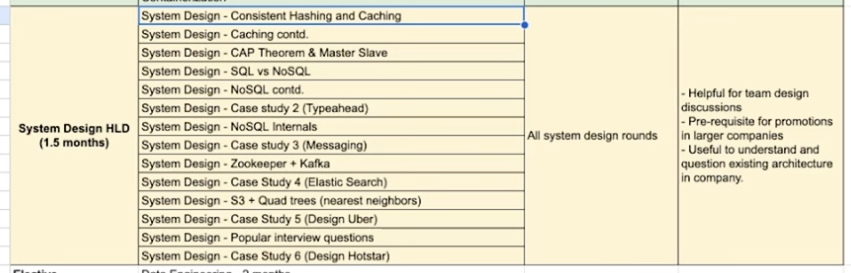

# Growth path senior BE
Created Wed May 15, 2024 at 11:41 PM

## Pay diff
Of 20x

## Why people fail (senior)
1. Not good at DSA, and they never work on problem solving
2. Weak Understanding of system design. Not able to rationalize ideas. Possible due to nature of work exposure (never worked on large systems)
3. Exposure but lack deep understanding - people work on tech stack due to job requirement, where they work on auto-pilot, never questioning nitty-gritty and general details.
4. Tech stack as identity (problem) - as you get senior stack matters less. You need to choose the stack w.r.t the problem. Anshuman worked on 3 tech stacks in FB and was given a week to learn those stacks.
5. Learn tech stack quickly. Including 
6. Troubleshoot stuff - logging into remote machines, checking running processes, analysizng network traffic
7. Solve ambiguous issue. To be able to *break down* (ambiguous) problems and finally solve it. e.g. bring 500ms to 150ms (this involves discovery, troubleshooting, experimentation, be-present-in-the-moment, like a medical doctor almost - there's urgency and importance).
8. Soft skills - communicate, prioritize, establish visibility of work (otherwise credit attribution will be wrong, fact).
9. Can review code or not.

## Fix
- Develop capability in current work, that solves some problems
- But need more
## Interviews
- Database: windowing functions, isolations levels people go blank
- Build stuff properly, not just build it.

(Junior below)

(Senior below)

## Curriculum

### Advanced languages
- Concurrent data structures, semaphores, how to synchronize code

### DSA
- Write efficient solution as second nature
- Build accuracy of code (works on first code, and debugging/trial-and-error is less)

### LLD
Most companies focus 3 kinds of rounds:
1. Knowledge based: what is a X?
2. Scenario based: get requirements, build schema
3. Machine coding round: build prototype of basic app like Google Calendar, BookMyShow

Helps on the jobs as well, for maintainable code (that stands the test of time), do code reviews.

## Advanced software engineering module
- Companies expect knowledge of it
- This also help develop learning from documentation

## HLD
- Concepts
- Components
- Case studies
- Learn to express and discuss
- Learn to solve ambiguous problems

## Curriculum does not help
What actually helps is assignments and TAs.

## Mentor
- You need someone poking your past experience, asking tough questions
- Mentor can tell you how to present your past experience
- 

### Conclude
This is for growth, and you can do with/without scaler.