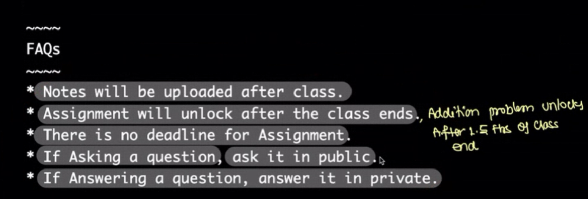
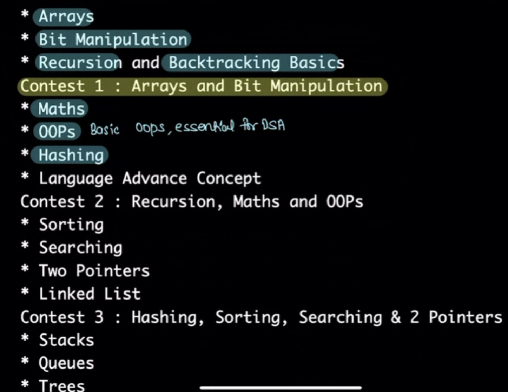
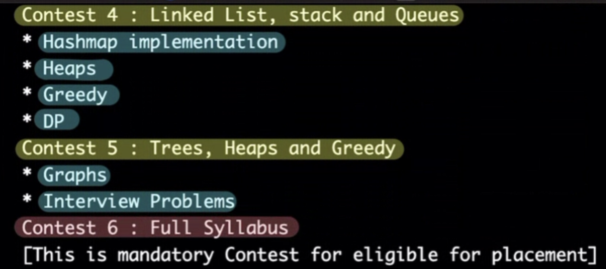
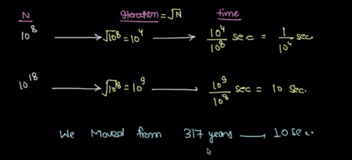
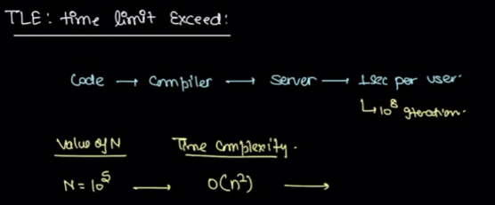
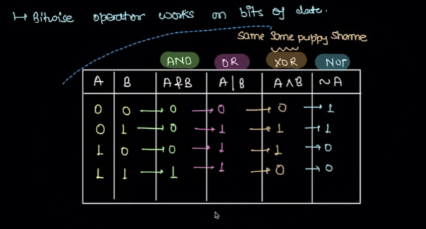

# 1. Time Complexity
Created Wed May 22, 2024 at 9:07 PM

## FAQs

## Focus of coming modules

## First quiz
Q1: Sum of first n natural numbers.
Q2: Range (count) between numbers. Inclusive: b-a+1, exclusive: b-a-1, one-side: b-a.
Q3: Given N > 0, count number of factors. 1, 
1, 2, 5, 10
algorithm for this, iterate (+1) until i*\i <= N
Q4: Prime algo (skip)

Q5: Nested loop table trick (make a table). Columns: i value, j value (... loops), count.

## Big Oh
1. Consider only the largest order term
2. Ignore multiplicative constants

## TLE (time limit exceeded)
Assumption: Code judge provides only 1 sec for your program to run. If it exceeds that time, you'll get TLE.
Assumed processing time: 10^8/s.

Q: Any usual memory constraint, like10e8 assumption?
A: usually no limit, but 10^4 size memory. And it usually comes for only in C++.

## Bitwise operator works on bits of data

- a | b >= max(a, b)
- a & b < max(a, b)
- XOR: no relation
- ~a changes sign. 
	- +ve, 0 become -ve
	- -ve become +ve, 0
- 1 left shift -> 2 * a. 
	- If a = 1, then k left shift = 2k. This means 2\*n without loop is a single expression, (1 << n). In O(1) time complexity. Important optimization in coding
- 1 right shift -> floor(...floor(a/2)) or directly a/2^n. Actually the prior, but answer wise both are equivalent (since off by 1 is rounded off if number is int), so O(1).

## Sq root of n
- Takes time log(n) if we do binary search.
## Summary
