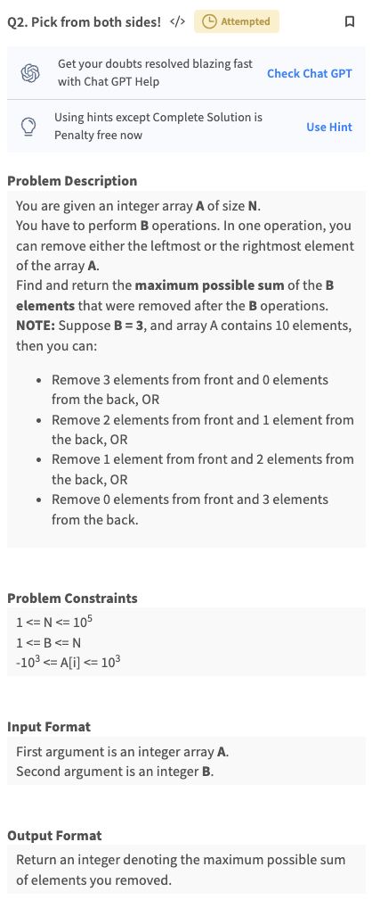

# 2. Array techniques
Created Fri May 24, 2024 at 9:10 PM

[Lecture notes](../../../../assets/2-Array-techniques-pdf-1-ab28a569.pdf)
## Lecture
### Reversing an array
1. Two pointers, one at the beginning, one at the end.
2. Keep swapping values, and moving pointers towards inside, by one.
3. Once they reach the same (odd size, so middle element remains intact), or cross, stop.

Worst case: O(n) time, O(1) space. n is size of array.

### Reverse a subarray
- What is a subarray. It's some contiguos part of an array.
- It could be of size 0 or of size n (whole array too).
- Number of subarrays = (size 1 subarrays) + (size 2 subarrays) + ... (size n subarrays) = n + n-1 + n-2 +... 1  = n(n+1)/2 = O(n<sup>2</sup>)

1. Create two pointers, set them from input window start, end (inclusive positions).
2. Apply the reversing an array algorithm, like above.

Worst case: O(n), O(1) space. n is size of array. Does not depend on size of the array.

### Range sum query
Given an array A, and a list of queries, where each query has two indexes L and R, sum of this sequence is the answer to the query.


### Naive approach
Just run a loop and calculate the sum.
- If there's a single query, then this is fine and optimal.
- But if there are unknown number of queries, say q, then worst case would be O(n\*q), O(1) space.

### Pre-computed table approach
Upon observation, it can be seen that if we save "sum uptil here" sum for each element, then sum from L to R happens to be table\[R] - table\[L-1].

- Initial table setup takes O(n) time, O(n) space complexity. i.e. you traverse, and maintain a sum uptill here variable, and keep storing that. Technically: `prefix[i] = prefix[i-1] + arr[i]`
- Query solving takes O(1) time.
- Complexity: Time O(n+q), O(n) space. Where n = size of array, q = number of queries.
	- If input is expendable, then input array can be overwritten during table creation (yes, it's possible), then space will be.

Note:
- Here the query asked for sum. But this approach is applicable if query asks for product (a \*b) too. Or in general any operation where "sliding window calculations" are possible. By sliding window I mean i.e. new window's value is equals current window + release last + acquire new.
	- In product case, skipping zeros is an important minor edge case.
	- There are many other queries like count, prime count etc.

### Equilibrium index

Important easing constraint, we consider sides until the ends.

### Naive approach
Loop over the array, and for each index, calculate left and right sums.

O(n<sup>2</sup>) time, O(1) space.

### Optimal approach (observation)
We can keep a variable for sum_until_now. Then right_sum = total_sum - sum_until_now. We just need to compare sum_until_now and right_sum. The sum_until_now can be calculated during an iteration, while total_sum can be pre-calculated. So n + n  = O(n) time. Space was 3 variables, aka O(1).
- There can be multiple equilibrium indices. i.e. if zero sum windows are present.

O(n) time, O(1) space.

### Print start and end of subarrays of length K
```js
startIndex = n-k; // 0 based counting so n-k+1 subarrays, this is the first
while(true) {
	endIndex = startIndex+k; // end index (length k)
	if(endIndex < n)
		console.log(startIndex, endIndex);
	else
		break;
}
```

O(n) time, O(1) space.
The key here is that subarray length is a CFE (closed form expression), and therefore, we don't need an enumeration loop. A single loop is enough.

### Max subarray sum with length k

### Naive approach
Traverse over each subarray using n-k+1 array, and in each iteration, calculate sum. So if n, k (size of subarray). Then total steps = number_of_subarrays * sum_time_for each array = (n-k+1) * k. So worst case comes for k=n/2, and is O(n<sup>2</sup>).

O(n<sup>2</sup>) time, O(1) time.

Note:
- So generally, worst case input may not be extreme inputs, could be middle ones. like here (quadratic formula).

### Table approach
Basically make a sum_uptill_here table for each element.
Then do the subarray loop, and now sum calculation is O(1) instead of looping-and-calculating-sum.

O(n) time, O(n) space.
### Sliding window approach
Traverse over subarrays, using n-k+1 formula, and keep maintaining sliding window sum as well as max_sum_encountered.

O(n) time, O(1) space


### Sum of all subarrays sum
#### Less optimal approaches
We'll loop over subarrays, then sum of size l subarrays:
1. Naive sum = O(n<sup>2</sup>)
2. Prefix sum = O(n)
3. Carry forward sum = O(1)
#### Better approach (reinterpret)
Reinterpret. We can optimize by rewriting the sum formula. Lets focus on one element (say i'th index element), and see how many time it's included in the sum. Lets consider variating on size of subarrays. There are 3 possibilities:
	1. Element at start of subarray. This is possible for sizes 1, 2 ...k? To find k, the subarray of that size would be the longest subarray starting from here (i). k = (n-1) - i + 1 = n-i. So number of instances (1, 2, 3, 4 ... n-i) = (n-i)-1+1 = n-i.
	2. Element somewhere in the middle of subarray? Simply said. Starting somewhere before. and ending somewhere after. Exclusive (i.e. not starting/ending here). (i-1) start possibilities on the left, and (n-(i) + (1)) end possibilities on the right. So total subarrays (and therefore possibilities) = i \* (n-i-1)
	3. Element at the end of the subarray. So all subarrays whose last element is at 'i'. Longest array is of size i, and min size is 2 (not 1 because we already considered one size in the start case). So possibilities = i - 1.

This means i'th element is included in sum, n-i + (i-1) \*(n-i+1) + i-1 times. So we got CFE for each term. Looping and applying this will give the answer.

O(n) time, O(1) space.

## Summary
Techniques discussed:
1. Naive looping
2. CFE loop elimination. *Knowing number of enumerations helps in avoiding a loop (if iterators are set properly)*
3. Pre-computed tables. *Works if rolling property holds.*
4. Sliding window. *Applies to sum, count, prime count etc.*

It is generally very-difficult/impossible to solve a unknown problem, at interview time. Unless you have brilliant command over math and computer science.

So the next practical thing is to look at many patterns, and solve many problems for each. This we the chance of solving a given problem (assuming it follows a known problem, or a combination of them) is much higher.

{i elements} {ith element} {n-i-1 elements}

Starting from i = n - i - 1
Ending at i = i
Between = i \* (n-i-1)
Size 1 = 1

## Assignments 
### Code problem 1  - Array rotation
**Problem Description**
Given an integer array A of size N and an integer B, you have to return the same array after rotating it B times towards the right.


**Problem Constraints**
1 <= N <= 105
1 <= A\[i] <=109
1 <= B <= 109

[Optimal solution idea](https://medium.com/@brandon93.w/rotate-array-problem-a-deep-dive-into-a-fundamental-coding-challenge-600b915734a5#:~:text=The%20Rotate%20Array%20Problem%20asks,continues%20from%20the%20first%20index.) O(n) time, O(1) space 
```js
function reverse(A, start, end) {
	let i = start, j = end;
	while(i < j) {
		const temp = A[i];
		A[i] = A[j];
		A[j] = temp;

		 i++; j--;
	}
}
module.exports = { 
 //param A : array of integers
 //param B : integer
 //return a array of integers
	solve : function(A, B){
		if(!A.length) return A;

		B =  B % A.length;
		reverse(A, 0, A.length -1);
		reverse(A, 0, B-1);
		reverse(A, B, A.length - 1);
		return A;
	}
};
```
### Code problem 2 - range sum query.
### Code problem 3 - Equilibrium index of an array
### Code problem 4 - sum of All Subarrays
**Problem Description**
You are given an integer array A of length N.
You have to find the sum of all subarray sums of A.
More formally, a subarray is defined as a contiguous part of an array which we can obtain by deleting zero or more elements from either end of the array.
A subarray sum denotes the sum of all the elements of that subarray.

Note : Be careful of integer overflow issues while calculations. Use appropriate datatypes.

**Problem Constraints**
1 <= N <= 105
1 <= Ai <= 10 4

```js
module.exports = { 
 //param A : array of integers
 //return a long integers
	subarraySum : function(A){
        const ZERO = BigInt(0);
        const ONE = BigInt(1);
        const n = BigInt(A.length);

        let sum = ZERO;
        for(let i = ZERO; i < n; i+=ONE) {
            const startFromHere = n-i-ONE;
            const endHere = i;
            const sizeOneSelf = ONE;
            const occursInBetween = i * (n-i-ONE);
            const frequency_of_i = startFromHere + endHere + sizeOneSelf + occursInBetween;
            sum += frequency_of_i * BigInt(A[i]);
        }
        return sum;
	} 
};
```

## Advanced assignments
### Code problem 5


```js
module.exports = { 
 //param A : array of integers
 //return an integer
	solve : function(A){
		const ZERO = BigInt(0);
		const ONE = BigInt(1);
		const TWO = BigInt(2);
		const n = BigInt(A.length);

		let even_sum = ZERO, odd_sum = ZERO;
		let B = Array(Number(n)).fill({});
		B.forEach((_, idx) => {
			idx = BigInt(idx);
			item = BigInt(A[idx]);

			B[idx] = {};

			if(idx % TWO)
			{
				odd_sum+=item;
				B[idx].odd = odd_sum;
				B[idx].even = even_sum;
			}
			else
			{
				even_sum+=item;
				B[idx].even = even_sum;
				B[idx].odd = odd_sum;
			}
		});

		// return JSON.stringify(B.map(item => ({odd: Number(item.odd), even: Number(item.even)})));
		let count = ZERO;
		for(let i = ZERO; i < n; i+=ONE) {
			if(i % TWO) {
				// remove odd.
				const left_side_odd_sum = B[i].odd - BigInt(A[i]);
				const right_side_odd_sum = B[n-ONE].even - B[i].even;

				const left_side_even_sum = B[i].even - ZERO;
				const right_side_even_sum = B[n-ONE].odd - B[i].odd;

				if(left_side_odd_sum + right_side_odd_sum === left_side_even_sum + right_side_even_sum) {
					count+=ONE;
				}
			}
			else {
				const left_side_odd_sum = B[i].odd - ZERO;
				const right_side_odd_sum = B[n-ONE].even - B[i].even;

				const left_side_even_sum = B[i].even - BigInt(A[i]);
				const right_side_even_sum = B[n-ONE].odd - B[i].odd;
				
				if(left_side_odd_sum + right_side_odd_sum === left_side_even_sum + right_side_even_sum) {
					count+=ONE;
				}
			}
		}

		return Number(count);
	}
};
```

### Coding problem 6

```js
module.exports = { 
 //param A : array of integers
 //return a array of integers
	solve : function(A){
        const total_product = A.reduce((accum, item) => accum * BigInt(item), BigInt(1));
        return A.map((item) => {
            item = BigInt(item);

            return total_product / item;
        });
	}
};
```

### Code problem 7

```js
module.exports = { 
 //param A : array of integers
 //param B : integer
 //return an integer
	solve : function(A, B){
        // traverse over all subarrays, consider average, and keep moving
        B = B % A.length;
        const number_of_subarrays = A.length - B + 1;
        let rolling_sum = A.reduce((accum, item, idx) => {
            if(idx < B) return accum + item;
            return item;
        }, 0);
        let min_sum = rolling_sum;
        let start_index = 0;
        for(let i = 1; i < number_of_subarrays; i++) {
            rolling_sum = rolling_sum - (A[i-1]) + A[i + B - 1];
            if(rolling_sum < min_sum)
                min_sum = rolling_sum, start_index = i;
        }
        return start_index;
	}
};
```

### Code problem 8
Trivial test cases pass but a hard one doesn't.


```js
function reverse(A, start = 0, end = null) {
    end = end || A.length - 1;
    let i = start, j = end;
    while(i < j) {
        const temp = A[i];
        A[i] = A[j];
        A[j] = temp;

        i++;
        j--;
    }
};

function rotate(A, k) {
    k = k % A.length;
    reverse(A);
    reverse(A, 0, k-1);
    reverse(A, k, A.length - 1);
};


module.exports = { 
 //param A : array of integers
 //param B : integer
 //return an integer
	solve : function(A, B){
        // [left part, ..., right_part]
        // since selection is cyclic, first rotate the array by B towards the right
        B = B % A.length;
        

        rotate(A, B); // [right_part, left_part, ...]
        const ZERO = BigInt(0);
        // return JSON.stringify(A);
        let rolling_sum = A.reduce((accum, item, idx) => {
            if (idx < B)
                return accum + BigInt(item);
            return accum;
        }, ZERO);
        let max_rolling_sum = rolling_sum;
        for(let i = 1; i < A.length - B + 1; i++) {
            rolling_sum = rolling_sum - BigInt(A[i-1] || ZERO) + BigInt(A[i + B - 1]);
            if(rolling_sum > max_rolling_sum)
                max_rolling_sum = rolling_sum;
        }
        return Number(max_rolling_sum);
	}
};
```