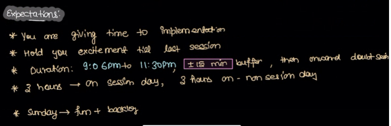
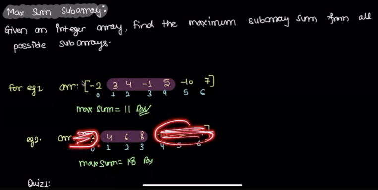
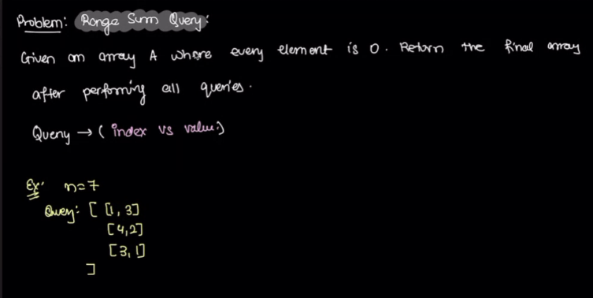
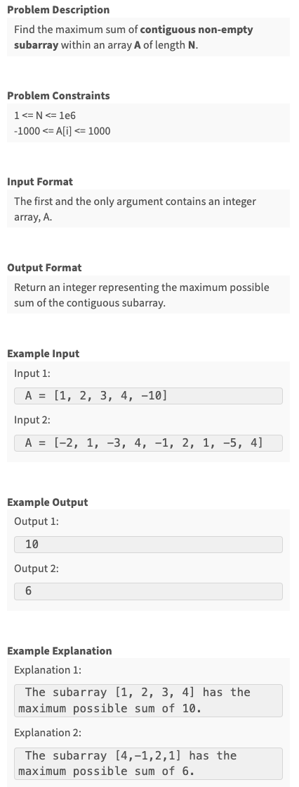
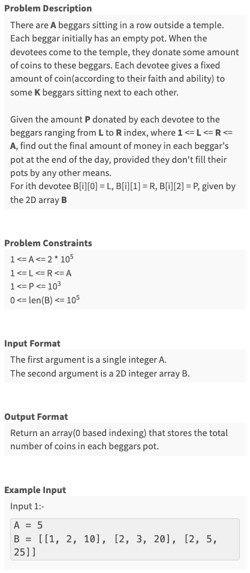
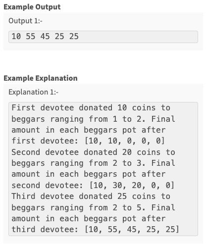
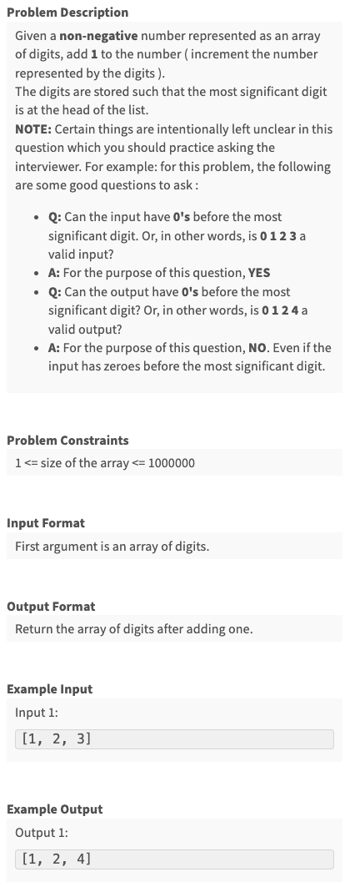
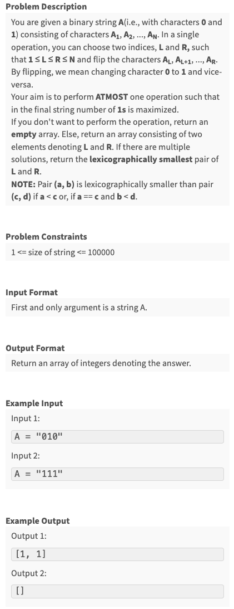
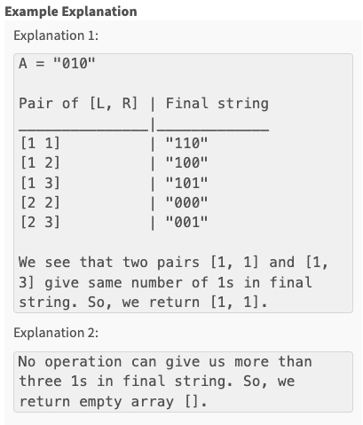
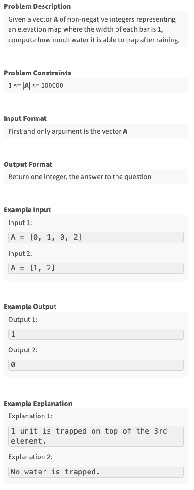

Created Mon May 27, 2024 at 9:18 PM

## General course expectations


## Lecture
### Maximum sum subarray


1. Subarrays cannot be of zero size. So if all elements of an array are negative, the max sum subarray will be of size n
2. Subsequences can of be zero size.

#### Naive approach
Iterate over subarrays, then sum and compare. O(n^3) O(1) time

#### Better approach
Use window sum. This will take O(n<sup>2</sup>) time, O(1) space.
No need to use prefix table, as that will be O(n<sup>2</sup>), O(n).

#### Optimal approach
Lets consider cases:
1. Only -window, +window, -window. That's all there is. Ok, just ignore extremes.
2. Only +window, +window, -window or -window, +window, +window. Just ignore one extreme.
3. +window, -window or +window, -window, same as 2.
4. +window, -window, +window. Can't decide just via sign. Select max(l + m + r, r).
   
We see that in each case, we have the maximum possible value we can pick that'll help us moving forward.
Now, lets consider an actual code iteration. We actually have just two choices - maintain-sum/reset-sum. And the choice is also easy since negative sum will not help us in any way, moving forward.

So even though it feels like we need multiple decisions, there's actually just one good choice.

O(n) time, O(1) space. since we advance no matter what.

### Range sum query

The array starts from all zeros. Then we process each query, i.e. by adding the right side part to each element with index at and after the left part.

#### Naive approach
We process all queries. O(nq) O(1).

#### Optimized solution (place all points, then do a carry forward iteration)
We need to place the values, but we travel a lot.
What we can do is, this.
For the first query, go to the index and make the number as in query. We know all right numbers have the same value.

In the second query, there are 3 cases:
1. Index is on the left. Mark the zero element with value. We know all values on the right needed to be added by it.
2. Index is the same. Just add the already placed element. Cool.
3. Index is on the right. Place the element, we know all values on right need addition.

Now lets observe what happens to an index. Basically, an index is affected by all set points on the left of it, which is just their some. That means if we place all points. And after the queries do a prefix sum iteration (i.e. keep storing sums), our sums will be correct. If we encounter zero, we just set it to current sum. If we get a non-zero value, we update sum and store it. So this is equivalent to the naive approach in terms of final answer. QED.

O(n+q), O(1)

#### Corollary (if queries were of bounded, i.e. form startI, endI, value)
We know that one sided query were fast. If we can convert this "complex" query into simple queries, our solution would stay linear.

If we ignore endI, and then elements ahead of endI will get unnecessary values. So lets compensate by setting (or adding to existing if any) negative value after endI (so negatives may be propagated during final pass). That's it.
`[l, r, v] is equivalent to [l, v] and [-v, r+1]` QED

So, we just have to do process double queries, but since complexity is linear, it will stay that way. So n+2q => O(n + q), O(1).

## Assignments
### Q1. Max Sum Contiguous Subarray

```js
module.exports = { 
 //param A : array of integers
 //return an integer
	maxSubArray : function(A){
        let l = A[0];
        let max_sum = A[0];
        const DEBUG = [];
        for(let i = 1; i < A.length; i++) {
            // l + m or m
            l = Math.max(l+A[i], A[i]);
            if(l > max_sum)
                max_sum = l;
            DEBUG.push(l);
        }

        // return JSON.stringify(DEBUG);
        return max_sum;
	}
};
```

### Q2. Continuous Sum Query


```js
module.exports = { 
 //param A : integer
 //param B : array of array of integers
 //return a array of integers
	solve : function(A, B){
        const valArr = Array(A).fill(0);
        for(let i = 0; i < B.length; i++) {
            const [l, r, v] = B[i];
            // apply l based query
            valArr[l-1] += v;
            if(r < A)
                valArr[r] -= v; // compensate
        }

        let currentSum = 0;
        for(let i = 0; i < valArr.length; i++) {
            currentSum+=valArr[i];
            valArr[i]=currentSum;
        }
        return valArr;
	}
};
```


## Advanced assignments
### Q1. Add One To Number

```js
module.exports = { 
 //param A : array of integers
 //return a array of integers
	plusOne : function(A){
        let carry  = 1;
        for(let i = A.length - 1; i >= 0; i--) {
            let newDigit = (A[i] + carry) % 10;
            carry = Math.floor((A[i]+carry)/10);
            A[i] = newDigit;
        }

        if(carry)
            A = [carry, ...A];

        let zeroSeen = true;
        return A.filter(i =>  { if(zeroSeen && i===0) return false; zeroSeen = false; return true;});
	}
};
```

### Q2. Flip


```js
module.exports = { 
 //param A : string
 //return a array of integers
	flip : function(A){
          // lets see the possibilities
          // [1s, ?, 1s] => [?]
          // [?, 1s] => [?]
          // [1s, ?] => [?]

          // [0s, ? , 0s] => what to do here?
          // there are 3 possibilities => flip 1, flip 2 or flip all. But ? could be a uniform window
          // in other words such flip1/flip2/flip3 won't do.

          // Approach 2: to maximize ones, lets find a window where number of zeros are maximum, and we'll negate this window, to convert maximum 0s into 1
          // what about other 0 windows, well if we flip them, it will not help us as much
          // So, this problem is like max subarray sum, i.e. we need to traverse, and also find the subarray where 0's are max
          // also, we need to avoid 1s as much as possible (if there are too many ones, we can't do anything)
          // there are two decisions to take, either continue the window, or reset it

          let max_length = 0;
          let max_start = -1, max_end = -1;
          let l = 0;
          let curr_length = 0;

          for(let i = 0; i < A.length; i++) {
                  curr_length += (A[i] === '1' ? -1 : 1);

                  if(curr_length < 0) {
                          l = i+1;
                          curr_length = 0;
                          continue;
                  }

                  if(curr_length > max_length) {
                          max_start = l;
                          max_end = i;
                          max_length = curr_length;
                  }
          }

          if(max_start === -1) return [];
          return [max_start+1, max_end+1]
	}
};
```

### Q3. Rain Water Trapped
Learning: focus on thinking better instead of making algorithm design process simpler/intuitive. There's no need to make the solution that could be understood by anyone (since making it that simple takes time).

Own solution (not the simplest) - has some bug:
```js
function trapHelper(A, leftWall, rightWall, start, end){
    // Trapped water for array = sum of trapped water of isolated segments
    // segments => [0, i, j ...]
    // lets solve for a segment => find maximum's in that segment + run the function in the same
    // T(w) = w + (w1+T(w1)) + (w2 + T(w2)) + ...
    // T(w) = w + (w1 + w2 + ....) + T(w1) + T(w2) + ...
    // in the simplest case T(w) = 1
    // T(w) = w + w + w  => 2w => O(w)

    // when we have windows, what happens to the edges
    // Infinity ... m ... m ... Infinity
    // the value is just a loop => sum(m - a[i]) on both sides

    if(end - start === 1) return 0;
    
    if(leftWall === rightWall) {
        let waterBetweenSameWalls = 0;
        for(let i = start+1; i < rightWall; i++) {
            waterBetweenSameWalls += (leftWall - A[i]);
        }
        return waterBetweenSameWalls;
    }

    // find equi max windows
    const max_value = -1;
    const max_indexes = [];
    for(let i = start; i < end; i++) {
        if(A[i] > max_value)
        {
            max_value = A[i];
            max_indexes = [i];
        }
        else if(A[i] === max_value) {
            max_indexes.push(i);
        }
    }

    // sum trapped water
    let trapped_water = 0;
    for(let i = 0; i < max_indexes.length; i++) {
        if(i === 0) {
            trapped_water += trapHelper(A, leftWall, max_value, start, max_indexes[i]); // i === 0
        }
        
        // this if-else takes care of if max wall is 1 (both i === 0 and i == len - 1 cases run)
        if(i === max_indexes.length - 1) {
            trapped_water += trapHelper(A, max_value, rightWall, max_indexes[i], end); // i === last
        }
        else {
            trapped_water += trapHelper(A, max_value, max_value, max_indexes[i], max_indexes[i+1]);
        }
    }
    
    return trapped_water;
}

module.exports = { 
 //param A : array of integers
 //return an integer
    trap : function(A){ return trapHelper(A, 0, 0, 0, A.length)},
};
```