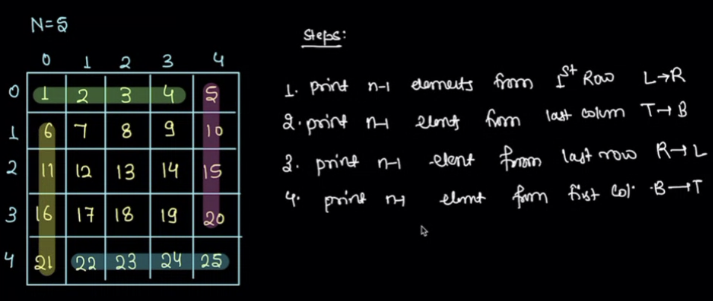
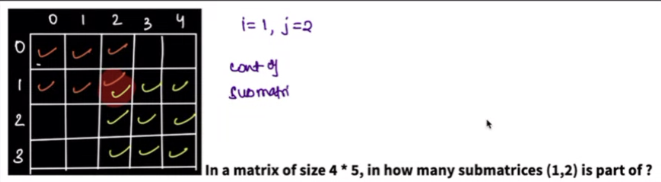

Created Wed May 29, 2024 at 10:30 PM
## Lectures

### Find number in matrix thats sorted both row and column wise
#### Naive approach
Do a range-check-and-binary-search, on either rows or columns.
O(m * log (n)) time, O(1) space

#### Optimal approach
If we could perform a walk in the matrix in a deterministic way, that would not require us to do searches.

Lets start from top-left =>  both right and down are increasing, so ambiguous.
Lets start from top-right => left if find lesser, down is finding greater. ok.
Lets start from bottom-left => left if find lesser, down is finding greater. ok.
Lets start from bottom-right => both right and down are decreasing, so ambiguous.

Lets pick start-from-top-right approach, and verify if we can always make a move. Note that movement depends on current (cell) value, not the values we'll be at (if we make a move). So top-right is unambiguous (as seen above). There are two possible moves:
1. To left: we do this when key is less than current. One extra thing is that it also invalidates all elements below (i.e. in column) current cell, and we never need to consider those.
2. To bottom: we do this when key is greater than current. One extra thing is that this move also invalidates all values to the left (i.e. in row), and we never need to consider them.
   
So, for each iteration, we are able to eliminate either a row or a column, and since movements only depends on current value (and not value-to be, which may be same in both direction, so them being equal is irrelevant). So by induction, we will always be able to make a move.

If we find the element, that's fine, and if we get thrown off the matrix, then return false.

### Binary matrix sorted rows find max row
Same thing, start from top-right, and move to the left until 1s are present. Once we are at the leftmost end of 1s, we move down, but actually, down and left, since we know the current max 1s row already.

We are moving optimally row wise (in a row), obviously.
To prove that we are moving optimally column wise, just observe that there's no need to consider the top rows (since we came from them already), and so the only option is to move down. And also left. If we encounter a 0 when we do down-and-left, we'll just drop down in the next case, instead of drop-and-left.

Reaching the last row will let us know the max 1s row. Can be kept track of using a variable, in addition to maxCount variable.

### Spiral print matrix (clockwise inside to out)
May be square or rect.

- Keep layerIndex variable.
- Keep direction variable.
- 4 for loops. count n - 2 * layerIndex - 1
- ~~stop-check-odd-even~~ (do a total count check simply)

### Boundary print matrix (clockwise inside to out)
A subset of the above problem, or code it directly

### Introduction to submatrix - concept
A rectangle bounded within given matrix is called a submatrix. Smallest possible submatrix is 1x1.

- Representation of submatrix. A simple approach is by using two points (top left and bottom right). Other combinations either have direction ambiguity. Ok.

### Sum of all possible submatrices
#### Naive approach
Traverse all. and sum. so cartesian (size x startPoint\[x, y] x sum) => O(n4) time

#### Slightly better
Use window sum, so summing becomes O(1).
so cartesian (size x startPoint\[x, y] x sum_1) => O(n3) time

#### Optimal approach (count contribution)
Lets count frequency of terms for given point (i, j). This is exactly the sort of breakdown we did with "sum of all possible subarray".

So, for P(i, j), the whole of 0 to i-1, and j-1 ending submatrices are not relevant.
P(i, j) => consider all variations. And to do reliably we need ti consider the representation of submatrix, i.e. 2 points top-left and bottom-right. lets look at top left from P(i, j)  there are total of i \* j (top left outer square, inclusive). And then lets look to bottom-right-inclusive P(i, j). There are total of (n-i) \* (n-j).

So total variations are: (i\*j) \* ((n-i) \* (n-j))

The only overlap is 1x1 cell P(i, j). This is true, even though the two ranges we considered were inclusive, since both are rectangles. But see carefully, even the 1x1 P(i, j) is not an overlap. See, if we write the multiplication as a sum: (red1 \* greens) + (red2 \* greens) + (bottom-right-red \* greens), all except bottom-right-red are simple and easy. Now, this expression is enough to get variates, and we don't need to write an expression for the greens. Also, expanding on the last term, again, bottom-right-red \* greens = bottom-right-red \* (top-left+green + green2 + green3...), in this bottom-right-red and top-left-green comes only once, so there's no overlap. Nothing to subtract.

Ok, so for each element P(i, j), its contribution is P\[i]\[j] * (i\*j) \* ((n-i) \* (n-j)). This is O(1) op.
To get the whole sum, iterate over all values, O(n2).

Perf: O(n2) time, O(1) space.

Learning:
- **Represent and combinatorics**: In problem where the goal is to count/sum/some-func all possible variations, the go to approach should be to properly (i.e. uniquely) represent a general variation. Then multiplication and overlap from combinatorics can be used, and since combinatoric formulas are O(1), the solutions will most likely be optimal.

## Assignments
