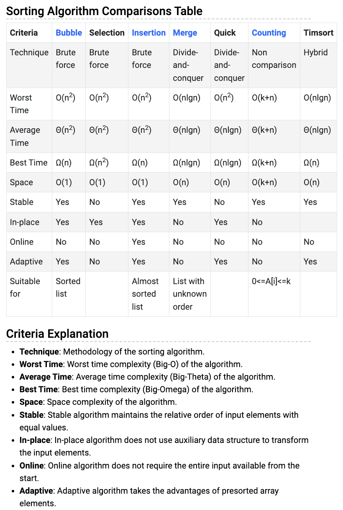

# 3. Sorting
Created Sat May 18, 2024 at 11:14 AM

## Why sorting
Sorting is important because it helps do some sorts of operations faster.
Even big data stuff like MapReduce keeps stuff sorted just because it makes operations faster.

## API
[2-Algorithms](../STL/2-Algorithms.md#Sorting)

## Solving use
- Sorted array allows for binary search

## Practical use
- Binary search is actually

## Algorithms
Sure, here's a list of common sorting algorithms, including both those with O(N^2) time complexity and more efficient ones:

### Comparative
1. **Bubble Sort** (O(N^2)): aka *bubble to the right while swapping*, compares adjacent elements and swaps them if they are in the wrong order, repeating this process until the list is sorted. Also keeps a is_sorted flag in each loop for early return. Complexity same on linked list.
2. **Insertion Sort** (O(N^2)) *insert element at the correct position, forms sorted array at the end*: Builds the final sorted list one item at a time by repeatedly taking elements from the input list and inserting them into their correct positions in the sorted list. Only online algorithm (since its general insert, can accommodate for new data).
3. **Selection Sort** (O(N^2)): *min select and swap, form sorted array* Divides the input list into a sorted sublist and an unsorted sublist, repeatedly finding the smallest (or largest) element from the unsorted sublist and moving it to the end of the sorted sublist.
4. **Merge Sort** (O(N log N), O(N) space): Divides the input list into two halves, recursively sorts each half, and then merges the sorted halves to produce the final sorted list. It's a divide-and-conquer algorithm and typically faster than the quadratic-time sorting algorithms for large datasets.
5. **Quick Sort** (O(N log N) average, O(N^2) worst-case, O(N) space): Selects a "pivot" element from the list and partitions the other elements into two sublists according to whether they are less than or greater than the pivot. It then recursively sorts the sublists.
6. **Heap Sort** (O(N log N) time, O(1) space) - "an implementation of selection sort using the right data structure.": Builds a binary heap from the input list and repeatedly extracts the maximum (for a max heap) element from the heap and rebuilds the heap until the list is sorted. It's not stable but has a guaranteed worst-case time complexity. O(1) space.
   
### Non-comparative
7. **Counting Sort** (O(N + K) time, O(k) space): Works well when the range of input elements is small. It counts the number of occurrences of each element and uses this information to place each element into its correct position in the output sequence.
8. **Bucket Sort** (O(N + K) time, O(N+K) space): Distributes elements into a number of "buckets" and then sorts each bucket individually, typically using another sorting algorithm like insertion sort or quicksort. It's efficient when the input is uniformly distributed over a range.
9. **Radix Sort** (O(NK) time, O(N+K) space): Sorts elements by processing individual digits of the numbers. It starts by sorting elements based on their least significant digit and progressively moves towards the most significant digit. Radix sort can achieve linear time complexity for integer sorting when the number of digits (K) is considered a constant. 

These algorithms offer different trade-offs in terms of time complexity, space complexity, and suitability for different types of data. Radix sort, counting sort, and bucket sort, in particular, are often used in scenarios where the input data has specific characteristics that make these algorithms more efficient than traditional comparison-based sorting algorithms like quick-sort and merge sort.

These are some of the common sorting algorithms, each with its own characteristics and best use cases depending on factors like the size of the dataset and stability requirements.

### Comparison of sorting algorithms
Note:
- Quick sort is not adaptive.
