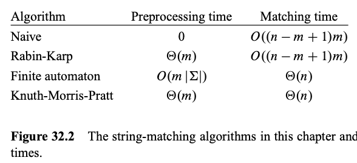

# 1. String
Created Tue May 14, 2024 at 9:38 PM

## API
See [1-Containers](../STL/1-Containers.md#String)

## Solving use
- Strings can be used when input is very large numbers
- Strings have a finite alphabet size, so practical bucketing is possible.

## Practical use
 - Efficient algorithms for this problem—called “string matching”—can greatly aid the *responsiveness* of the text-editing programs.
 - Search for particular patterns in DNA sequences.
 - Internet search engines also use them to find Web pages relevant to queries.

## Notable info
### String matching
Text-editing programs frequently need to find all occurrences of a pattern in the text.

#### Naive algorithm
- Working: Moves forward usually, but on first sign of trouble (mismatch), goes back by word size (-1).
- Con: goes back too much on mismatch. Kind of anti-KMP.
- O(m\*n) time, O(1) space.
	- O(n) time, O(1) space, for very short words and long text.

#### KMP (Knuth-Morris-Pratt)
- Main idea: Keep stored knowledge of Word for reuse.
- Main trait: Never moves backwards in the Text.
- Working: Precomputes an array, which takes O(m) time), from the word string. Then effectively always moves forward in Text (checking against precomputed array). On collision, moves to most-right-side-possible and continues.
- *Most powerful among string matching algos.*
- O(m+n) time, O(m) space.
	- O(n) time, O(1) space, for very short words and long text.
- Video: https://www.youtube.com/watch?v=V5-7GzOfADQ&ab_channel=AbdulBari

#### Rabin-Karp
- Main idea: Two levels of checking - one weak, other normal (strong). i.e. Gets rids of false positives fast.
- Working: Decide a rolling hash, precompute hash of the Word (O(m) time). Then for each movement in Text, do O(1) hash compute and O(1) check. When hash matches, do an actual comparison matching.
- O(m\*n) time, O(m) space.
	- O(n) time, O(1) space, for very short words and long text.
- Video: https://www.youtube.com/watch?v=qQ8vS2btsxI&ab_channel=AbdulBari