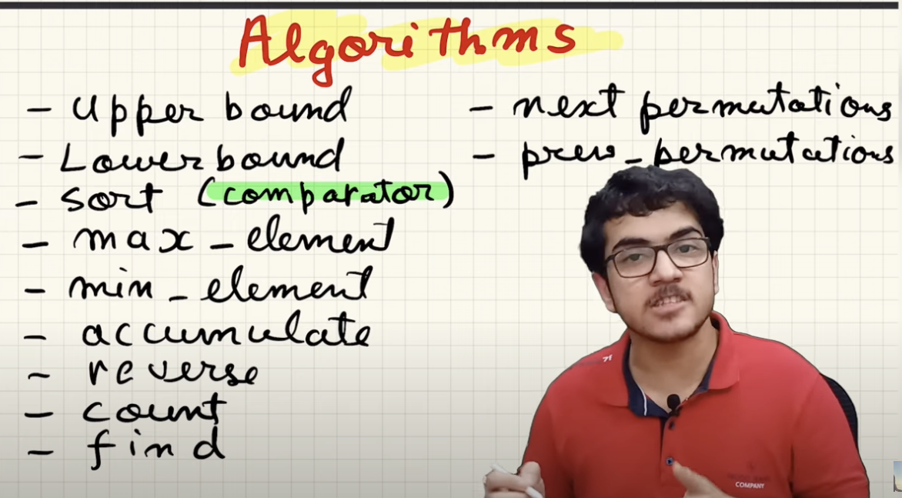

# 2. Algorithms
Created Sun May 12, 2024 at 7:35 PM



## Linear search
`find` is a function (not method) that can be used on any container. 
*BUT, we'll avoid giving this too much precedence since most container have a method named find (method, not function), that's much faster.* *Less confusion.*
```cpp
vector<int> v;
auto it = find(v.begin(), v.end(), 20);
```

## Binary search
Reference: https://cplusplus.com/reference/algorithm/#:~:text=range%20(function%20template)-,binary%20search,-(operating%20on%20partitioned
### Existence
```cpp
binary_search(startIt, endIt, key); // existence check
// e.g 10 10 10 20 20 20 30 30
// key=20 => true
// key=21 => false
```
### Lower bound (left side = || >)
```cpp
// Lower bound means "left side" (<=)
lower_bound (startIt, endIt, key);
lower_bound(v.begin(), v.end(), 20); // v is a vector

// e.g 10 10 10 20 20 20 30 30, key=20
// Result  is ..., 10, ^20
```
### Upper bound (right side >)
```cpp
// upper bound means "right side" (>)
upper_bound (startIt, endIt, key);
upper_bound(v.begin(), v.end(), 20); // v is a vector

// e.g 10 10 10 20 20 20 30 30, key=20
// Result  is ..., 20, ^30, ...
```

### Range (range from left to right side)
Get "equivalent" range.
```cpp
// left side >=, right side >
equal_range(startIt, endIt, key);

// e.g 10 10 10 20 20 20 30 30, key=20
// range is [20, 20, 20, 30]
```

## Min and max
### Get value
2-valued function.
```cpp
min(a, b);
	min(a, b, customFunctor);
	int x = min(1, 2);
	
max (/* same as above */)
auto xPair = minmax (/* same as above */)
```
### Get location
```cpp
min_element(startIt, endIt);
	min_element(startIt, endIt, customFunctor);
	
max_element (/* same as above */)
auto itPair = minmax_element (/* same as above */)
```

## Sorting
Reference: https://cplusplus.com/reference/algorithm/#:~:text=point%20(function%20template)-,sorting
All are in-place ops.
### sort (non stable)
`std::sort` works for any container (except strict ADTs like stack, queue, or already sorted ones)
```cpp
sort(startI, endI) // natural sort, i.e. increasing order, alphabetical order
	sort(startI, endI, greater<int>()) // decreasing order. 
	// Remember: greater is a call here, min PriorityQueue declaration is not a call.
	
	sort(starI, endI, [] -> bool (auto a, auto b){ return is_should_keep; }); // custom
```

### stable_sort
```cpp
stable_sort(startIt, endIt);
	stable_sort(startIt, endIt, greater<int>()); // decreasing order
	stable_sort(starI, endI, [] -> bool (auto a, auto b){ return is_should_keep; }); // custom
```

### Check if sorted
```cpp
is_sorted(startIt, endIt);

vector<int> v;
bool isSorted = is_sorted(v.begin(), v.end());
```

## Comparison
### Equality
Compare two ranges.
```cpp
equal(startIt1, endIt1, startIt2, endIt2);
	equal(startIt1, endIt1, startIt2, endIt2, customFunctor); // [](a, b){ return a==b; }
```
## Alphabetic order
```cpp
lexicographic_compare(startIt1, endIt1, startIt2, endIt2);
	lexicographic_compare(startIt1, endIt1, startIt2, endIt2, compareFunctor); // TBD
```
## All, any, none
```cpp
all_of (startIt, endIt, customFunctor);
any_of (startIt, endIt, customFunctor); // !all_of(!item)
none_of(startIt, endIt, customFunctor);
```

## Higher-order functions
Can work on any data structure (except strict ADT like stack).
### Map
```cpp
// HOFs - need decltype, back_inserter
// // map - transform()
decltype(v) output (v.size());
tranform(v.begin(), v.end(), output.begin(), [](){ return 1; }); // new array
	tranform(v.begin(), v.end(), v.begin(), [](){ return 1; }); // in-place
```

### Filter
```cpp
// // Filter - copy_if()
decltype(v) output;
copy_if(v.begin(), v.end(), back_inserter(output), [](){ return 1; }); // new array
	 // in-place - resize, distance
	auto it = copy_if(v.begin(), v.end(), v.begin(), [](){ return 1; });
	v.resize(distance(v.begin(), it));

```

### Reduce
```cpp
// // Reduce - accumulate()
auto result = accumulate(v.begin(), v.end(), 0, [](auto accum, auto item){ return accum * item; });
```

### Count
```cpp
count(v.begin(), v.end(), key); // uses operator ==

count_if(v.begin(), v.end(), customFunctor); // [](auto a){}
```

## Sequence ops
### Reverse
Its a function, no container level methods are present.
In place operation.
```cpp
void reverse(startIt, endIt);

vector<int> v;
reverse(v.begin(), v.end());

string s;
reverse(s.begin(), s.end());
```

### Rotate
Rotate by k to the left. (movement right to left). 
In place operation.
```cpp
rotate(startIt, middleIt, endIt); // rotates such that middleIt, becomes the first element
	rotate(startIt, startIt + k, endIt); // intuitive, rotate k to left.
	rotate(startIt, endIt - k, endIt); // intuitive, rotate k to right.

vector<int> v;
auto newVecIt = rotate(v.begin(), v.begin()+2, v.end());

string s;
auto newStrIt = rotate(s.begin(), s.begin()+2, s.end());
```

### Partition
```cpp
auto firstItemOfRightGroupIt
 = partition(v.begin(), v.end(), customFunctor); // [](auto a) { return isOnLeft; }
	partition(v.begin(), v.end(), [](auto i) { return i <= k; }); // parition w.r.t value k

	stable_partition()// works the same but keeps stability (same values stay in order)
```
### Merge
```cpp
merge(startIt1, endIt1, startIt2, endIt2, writerIt);
	// for vector
	decltype(v1) output (v1.size() + v2.size(), 0);
	merge(v1.begin(), v1.end(), v2.begin(), v2.end(), output.begin());
```

## Set operations
General set operations - do not exist. ❌
STL has functions only for sorted sets. All 4 supported:
```cpp
set_union(startIt1, endIt1, startIt2, endIt2, writerIt);
set_intersection (/* same as above */)
set_difference (/* same as above */)
set_symmetric_difference (/* same as above */)
```
## Permutations
In-place operation. O(n/2).
```cpp
next_permutation(startIt, endIt);
	next_permutation(startIt, endIt, compareFunctor); // [](auto a, b) { return is_should_swap; }

previous_permutation(startIt, endIt);
```
TBD